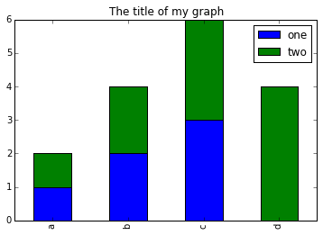
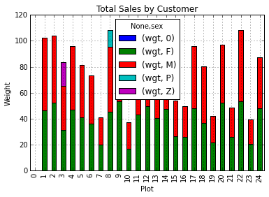

## Working With Pandas DataFrames in Python


### Learning Objectives
* Explain what a library is, and what libraries are used for.
* Load a Python/pandas library.
* Read tabular data from a file into Python using Pandas using `read_csv`.
* Learn about the Pandas DataFrame object.
* Learn about data slicing and indexing.
* Perform mathematical operations on numeric data.
* Create simple plots of data.

## About Libraries
A library in Python contains a set of tools (called functions) that perform
tasks on our data. Importing a library is like getting a piece of lab equipment
out of a storage locker and setting it up on the bench for use in a project.
Once a library is set up, it can be used or called to perform many tasks.

## Pandas in Python
One of the best options for working with tabular data in python is to use the
[Python Data Analysis Library](http://pandas.pydata.org/) (a.k.a. pandas). The
Pandas library provides data structures, produces high quality plots with
[matplotlib](http://matplotlib.org/) and integrates nicely with other libraries
that use [NumPy](http://www.numpy.org/) (which is another Python library) arrays.

Python doesn't load all of the libraries available to it by default. We have to
add an `import` statement to our code in order to use library functions. To import
a library, we use the syntax `import libraryName`. If we want to give the
library a nickname to shorten the command, we can add `as nickNameHere`.  An
example of importing the pandas library using the common nickname `pd` is below.


```python
import pandas as pd
```

Each time we call a function that's in a library, we use the syntax
`LibraryName.FunctionName`. Adding the library name with a `.` before the
function name tells python where to find the function. In the example above, we
have imported pandas as `pd`. This means we don't have to type out `pandas` each
time we call a pandas function.


## Lesson Overview

We are studying the species and weight of animals caught in plots in a study
area. The data sets are stored in .csv (comma separated value) format. Within
the `.csv` files, each row holds information for a single animal, and the
columns represent: record_id, month, day, year, plot, species, sex, wgt.

The first few rows of our first file look like this:

```python

"record_id","month","day","year", "plot","species","sex","wgt"

"63","8","19","1977","3","DM","M","40"

"64","8","19","1977","7","DM","M","48"

"65","8","19","1977","4","DM","F","29"

"66","8","19","1977","4","DM","F","46"

"67","8","19","1977","7","DM","M","36"
```

### We want to:

1. Load that data into memory in Python.
2. Calculate the average weight of all individuals sampled, by species.
3. Plot the average weights by species and perhaps by plot too.

We can automate the process above using Python. It's efficient to spend time
building the code to perform these tasks because once it's built, we can use it
over and over on different datasets that use a similar format. This makes our
methods easily reproducible. We can also easily share our code with colleagues
and they can replicate the same analysis.

# Reading Data Using Pandas CSV
We will begin by locating and reading our survey data which are in CSV format.
We can use Pandas `read_csv` function to pull the file directly into a
[DataFrame](http://pandas.pydata.org/pandas-docs/stable/dsintro.html#dataframe).

## So What's a DataFrame?

A DataFrame is a 2-dimensional data structure that can store data of different
types (including characters, integers, floating point values, factors and more)
in columns. It is similar to spreadsheets or SQL tables or the `data.frame` in
R.

First, let's make sure the python Pandas library is loaded. We will import
Pandas using the nickname `pd`.

```python
import pandas as pd
```

Let's also import the [OS Library](https://docs.python.org/2/library/os.html). This library allows us to make sure we are
in the correct working directory. If you are working in
IPython Notebook, be sure to start the notebook in the workshop repository.
If you didn't do that you can always set the working directory using the code
below.

```python
import os
os.getcwd()
# if this directory isn't right, use the command below to set the working directory
os.chdir("YOURPathHere")
```	

```python
# note the pd.read_csv is used because we imported pandas as pd
pd.read_csv("data/surveys.csv")
```

The above command yields the **output** below:

```
       record_id  month  day  year  plot species  sex  wgt
0              1      7   16  1977     2     NaN    M  NaN
1              2      7   16  1977     3     NaN    M  NaN
2              3      7   16  1977     2      DM    F  NaN
3              4      7   16  1977     7      DM    M  NaN
4              5      7   16  1977     3      DM    M  NaN
5              6      7   16  1977     1      PF    M  NaN
6              7      7   16  1977     2      PE    F  NaN
7              8      7   16  1977     1      DM    M  NaN
8              9      7   16  1977     1      DM    F  NaN
9             10      7   16  1977     6      PF    F  NaN
10            11      7   16  1977     5      DS    F  NaN
11            12      7   16  1977     7      DM    M  NaN
12            13      7   16  1977     3      DM    M  NaN
13            14      7   16  1977     8      DM  NaN  NaN
...
[35549 rows x 8 columns]
```
We can see that there were 33,549 rows parsed. Each row has 8 
columns. It looks like  the `read_csv` function in Pandas read our file
properly. However, we haven't saved any data to memory so we can work with it.
We need to assign the DataFrame to a variable. Remember that a variable is a
name for a value, such as `x`, or  `data`. We can create a new object with a
variable name by assigning a value to it using `=`.

Let's call the imported survey data `surveys_df`:

```python
surveys_df = pd.read_csv("data/surveys.csv")
```

Notice when you assign the imported dataframe to a variable, python does not
produce any output on the screen. We can print the value of the `surveys_df`
object by typing its name into the python command prompt.

```python
surveys_df
```

which returns:


```
       record_id  month  day  year  plot species  sex  wgt
0              1      7   16  1977     2     NaN    M  NaN
1              2      7   16  1977     3     NaN    M  NaN
2              3      7   16  1977     2      DM    F  NaN
3              4      7   16  1977     7      DM    M  NaN
4              5      7   16  1977     3      DM    M  NaN
5              6      7   16  1977     1      PF    M  NaN
6              7      7   16  1977     2      PE    F  NaN
7              8      7   16  1977     1      DM    M  NaN
8              9      7   16  1977     1      DM    F  NaN
9             10      7   16  1977     6      PF    F  NaN
10            11      7   16  1977     5      DS    F  NaN
11            12      7   16  1977     7      DM    M  NaN
12            13      7   16  1977     3      DM    M  NaN
13            14      7   16  1977     8      DM  NaN  NaN
...
[35549 rows x 8 columns]
```

## Manipulating Our Species Survey Data

Now we can start manipulating our data. First, let's check data type of object
that `surveys_df` is using the `type` method. The `type` method and
`__class__` attribute tell us that `surveys_df` is `<class
'pandas.core.frame.DataFrame'>`.

```python
type(surveys_df)
# this does the same thing as the above!
surveys_df.__class__
```
We can also use the `surveys_df.dtypes` command to view the data type for each
column in our dataframe. Int64 represents numeric integer values - int64 cells
can not store decimals. Object represents strings (letters and numbers). Float64
represents numbers with decimals.

	surveys_df.dtypes

which returns:

```
record_id      int64
month          int64
day            int64
year           int64
plot           int64
species       object
sex           object
wgt          float64
dtype: object
```
We'll talk a bit more about what the different formats mean in a different lesson.

### Useful Ways to View DataFrame objects in Python

There are multiple methods that can be used to summarize and access the data
stored in dataframes. Let's try out a few. Note that we call the method by using
the object name `surveys_df.method`. So `surveys_df.columns` provides an index
of all of the column names in our DataFrame.

## Challenges
Try out the methods below to see what they return.

1. `surveys_df.columns`
2. `surveys_df.head()`. Also, what does `surveys_df.head(15)` do?
3. `surveys_df.tail()`.
4. `surveys_df.shape` - Take note of the output of the shape method. What format does it return the shape of the DataFrame in?

HINT: [More on tuples, here](https://docs.python.org/2/tutorial/datastructures.html#tuples-and-sequences).


## Calculating Statistics From Data In A Pandas DataFrame


We've read our data into Python. Next, let's perform some quick summary
statistics to learn more about the data that we're working with. We might want
to know how many animals were collected in each plot, or how many of each
species were caught. We can perform summary stats quickly using groups. But
first we need to figure out what we want to group by.

Let's begin by exploring our data:

```python
# Look at the column names
surveys_df.columns.values
```

which **returns**:

```
array(['record_id', 'month', 'day', 'year', 'plot', 'species', 'sex', 'wgt'], dtype=object)
```


Let's get a list of all the species. The `pd.unique` function tells us all of
the unique values in the species column.

```python
pd.unique(surveys_df.species)
```

which **returns**:

	array(['NL', 'DM', 'PF', 'PE', 'DS', 'PP', 'SH', 'OT', 'DO', 'OX', 'SS',
    	   'OL', 'RM', nan, 'SA', 'PM', 'AH', 'DX', 'AB', 'CB', 'CM', 'CQ',
    	   'RF', 'PC', 'PG', 'PH', 'PU', 'CV', 'UR', 'UP', 'ZL', 'UL', 'CS',
       	   'SC', 'BA', 'SF', 'RO', 'AS', 'SO', 'PI', 'ST', 'CU', 'SU', 'RX',
       	  'PB', 'PL', 'PX', 'CT', 'US'], dtype=object)

## Challenges

1. Create a list of unique plot ID's found in the surveys data. Call it
   `plotNames`. How many unique plots are there in the data? How many unique
   species are in the data?

# Groups in Pandas

We often want to calculate summary statistics grouped by subsets or attributes
within fields of our data. For example, we might want to calculate the average
weight of all individuals per plot.

We can also extract basic statistics for all rows in a column, individually
using the syntax below:

```python
surveys_df['wgt'].describe()
```
gives **output**

```python
count    32283.000000
mean        42.672428
std         36.631259
min          4.000000
25%         20.000000
50%         37.000000
75%         48.000000
max        280.000000
dtype: float64
```

We can also extract one specific metric if we wish:

```python
surveys_df['wgt'].min()
surveys_df['wgt'].max()
surveys_df['wgt'].mean()
surveys_df['wgt'].std()
surveys_df['wgt'].count()
```

But if we want to summarize by one or more variables, for example  sex, we can
use the `.groupby` method in Pandas. Once we've created a groupby DataFrame, we
can quickly calculate summary statistics by a group of our choice.

```python
# Group data by sex
sorted = surveys_df.groupby('sex')
```

The pandas function `describe` will return descriptive stats including: mean,
median, max, min, std and count for a particular column in the data. Pandas
`describe` function will only return summary values for columns containing
numeric data.

```python
# summary statistics for all numeric columns by sex
sorted.describe()
# provide the mean for each numeric column by sex
sorted.mean()
```

`sorted.mean()` **OUTPUT:**

```python
        record_id        day         year       plot        wgt
sex
F    18036.412046  16.007138  1990.644997  11.440854  42.170555
M    17754.835601  16.184286  1990.480401  11.098282  42.995379
P    22488.000000  21.000000  1995.000000   8.000000  13.000000
R    21704.000000  12.000000  1994.000000  12.000000        NaN
Z    23839.000000  15.000000  1996.000000   3.000000  18.000000

```

The `groupby` command is powerful in that it allows us to quickly generate
summary stats. This is also useful for initial examination of our data. We can
immediately notice some unusual values in our data that we might need to explore
further. Unless we're working with butterflies, Z is unlikely to be a sex. Also
it looks like there are no weight values for the species that is of sex "R". It
is important to explore your data, before diving into analysis too quickly.

# Challenge

1. How many records contain the sex designations of: "Z", "P" and "R"?
2. What happens when you group by two columns using the syntax and then grab
   mean values:
	- `sorted2 = surveys_df.groupby(['plot','sex'])`
	- `sorted2.mean()`
3. Summarize weight values for each plot in your data. HINT: you can use the
   following syntax only create summary statistics for one column in your data
   `byPlot['wgt'].describe()`


Did you get #3 right? **A Snippet of the Output from challenge 3 looks like:**

	plot
	1     count    1903.000000
	      mean       51.822911
	      std        38.176670
	      min         4.000000
	      25%        30.000000
	      50%        44.000000
	      75%        53.000000
	      max       231.000000

## Quickly Creating Summary Counts in Pandas

Let's next create a list of unique species in our data. We can do this in a few
ways. But we'll use `groupby` combined with a `count()` method.


```python
# count the number of samples by species
species_list = surveys_df['record_id'].groupby(surveys_df.species).count()

['wgt']
```

Or, we can also count just the rows that have the species "DO":

```python
surveys_df['record_id'].groupby(surveys_df.species).count()['DO']
```

## Basic Math Functions

If we wanted to, we could perform math on an entire column of our data. For
example let's multiply all weight values by 2. A more practical use of this might
be to normalize the data according to a mean, area, or some other value
calculated from our data.

	# multiply all weight values by 2
	surveys_df['wgt']*2


## Another Challenge

1. What's another way to create a list of species and associated `count` of the
   records in the data. Hint: you can perform `Count`, `Min`, etc functions on
   groupby DataFrames in the same way you can perform them on regular
   DataFrames.


# Quick & Easy Plotting Data Using Pandas

We can plot our summary stats using Pandas, too.

	# make sure figures appear inline in Ipython Notebook
	%matplotlib inline
	# create a quick bar chart
	species_list.plot(kind='bar');


Weight by species plot

We can also look at how many animals were captured in each plot:

```python
total_count=surveys_df.record_id.groupby(surveys_df['plot']).nunique()
# let's plot that too
total_count.plot(kind='bar');
```

# Challenge Activities

1. Create a plot of average weight across all species per plot.
2. Create a plot of total males versus total females for the entire dataset.


# Summary Plotting Challenge

Create a stacked bar plot, with weight on the Y axis, and the stacked variables
being sex. The plot should show total weight by sex for each plot. Some 
tips are below to help you solve this challenge:

* [For more on Pandas plots, visit this link.](http://pandas.pydata.org/pandas-docs/dev/generated/pandas.core.groupby.DataFrameGroupBy.plot.html)
* You can use the code that follows to create a stacked bar plot but the data to stack
  need to be in individual columns.  Here's a simple example with some data where
  'a', 'b', and 'c' are the groups, and 'one' and 'two' are the subgroups.

```
d = {'one' : pd.Series([1., 2., 3.], index=['a', 'b', 'c']),'two' : pd.Series([1., 2., 3., 4.], index=['a', 'b', 'c', 'd'])}
pd.DataFrame(d)
```

shows the following data

```
       one  two
   a    1    1
   b    2    2
   c    3    3
   d  NaN    4
```

We can plot the above with

```
# plot stacked data so columns 'one' and 'two' are stacked
my_df = pd.DataFrame(d)
my_df.plot(kind='bar',stacked=True,title="The title of my graph")
```



* You can use the `.unstack()` method to transform grouped data into columns
for each plotting.  Try running `.unstack()` on some dataframes above and see
what it yields.

Start by transforming the grouped data (by plot and sex) into an unstacked layout, then create
a stacked plot.


Answer to Summary Challenge
---------------------------


The next two lines group data by plot and by sex, and then have sum the total for each plot.

```
by_plot_sex = surveys_df.groupby(['plot','sex'])
plot_sex_count = by_plot_sex['wgt'].sum()
```

This calculates the sums of weights for each sex within each plot as a table

```
plot  sex
1     F      38253
      M      59979
2     F      50144
      M      57250
3     F      27251
      M      28253
      Z         18
4     F      39796
      M      49377
<other plots removed for brevity>
```

Below we'll use `.unstack()` on our grouped data to figure out the total weight that each sex contributed to each plot.

```
by_plot_sex = surveys_df.groupby(['plot','sex'])
plot_sex_count = by_plot_sex['wgt'].sum()
plot_sex_count.unstack()
```

Will give us output like the following if we display it

```
sex       F      M   P   R   Z
plot
1     38253  59979 NaN NaN NaN
2     50144  57250 NaN NaN NaN
3     27251  28253 NaN NaN  18
4     39796  49377 NaN NaN NaN
<other plots removed for brevity>
```

Now, create a stacked bar plot with that data where the weights for each sex are stacked by plot.

Rather than display it as a table, we can plot the above data by stacking the values of each sex as follows

```
by_plot_sex = surveys_df.groupby(['plot','sex'])
plot_sex_count = by_plot_sex['wgt'].sum()
spc = plot_sex_count.unstack()
s_plot = spc.plot(kind='bar',stacked=True,title="Total weight by plot and sex")
s_plot.set_ylabel("Weight")
s_plot.set_xlabel("Plot")
```


