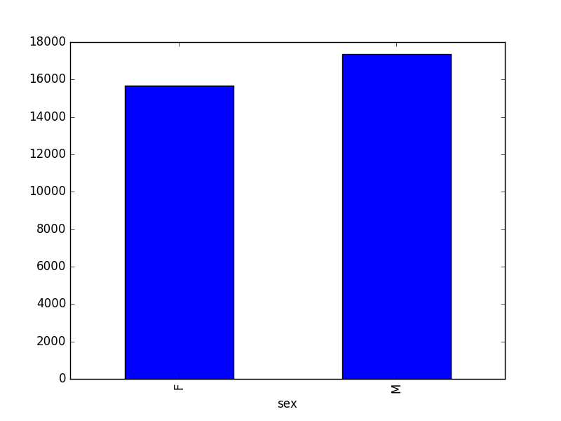

::::::::::::::::::::::::::::::::::::::: objectives

- Navigate the workshop directory and download a dataset.
- Explain what a library is and what libraries are used for.
- Describe what the Python Data Analysis Library (Pandas) is.
- Load the Python Data Analysis Library (Pandas).
- Read tabular data into Python using Pandas.
- Describe what a DataFrame is in Python.
- Access and summarize data stored in a DataFrame.
- Define indexing as it relates to data structures.
- Perform basic mathematical operations and summary statistics on data in a Pandas DataFrame.
- Create simple plots.

::::::::::::::::::::::::::::::::::::::::::::::::::

:::::::::::::::::::::::::::::::::::::::: questions

- How can I import data in Python?
- What is Pandas?
- Why should I use Pandas to work with data?

::::::::::::::::::::::::::::::::::::::::::::::::::

## Working With Pandas DataFrames in Python

We can automate the process of performing data manipulations in Python. It's efficient to spend time
building the code to perform these tasks because once it's built, we can use it
over and over on different datasets that use a similar format. This makes our
data manipulation processes reproducible. We can also share our code with
colleagues and they can replicate the same analysis starting with the same original data.

#### Starting in the same spot

To help the lesson run smoothly, let's ensure everyone is in the same directory.
This should help us avoid path and file name issues. At this time please
navigate to the workshop directory. If you are working in Jupyter Notebook be sure
that you start your notebook in the workshop directory.

#### Our Data

For this lesson, we will be using the Portal Teaching data, a subset of the data
from Ernst et al.
[Long-term monitoring and experimental manipulation of a Chihuahuan Desert ecosystem near Portal,
Arizona, USA][ernst].

We will be using files from the [Portal Project Teaching Database][pptd].
This section will use the `surveys.csv` file that can be downloaded here:
[https://ndownloader.figshare.com/files/2292172][figshare-ndownloader]

We are studying the **species** and **weight** of animals caught in sites in our study
area. The dataset is stored as a `.csv` file: each row holds information for a
single animal, and the columns represent:

| Column          | Description                   | 
| --------------- | ----------------------------- |
| record\_id       | Unique id for the observation | 
| month           | month of observation          | 
| day             | day of observation            | 
| year            | year of observation           | 
| plot\_id         | ID of a particular site       | 
| species\_id      | 2-letter code                 | 
| sex             | sex of animal ("M", "F")      | 
| hindfoot\_length | length of the hindfoot in mm  | 
| weight          | weight of the animal in grams | 

The first few rows of our first file look like this:

```output
record_id,month,day,year,plot_id,species_id,sex,hindfoot_length,weight
1,7,16,1977,2,NL,M,32,
2,7,16,1977,3,NL,M,33,
3,7,16,1977,2,DM,F,37,
4,7,16,1977,7,DM,M,36,
5,7,16,1977,3,DM,M,35,
6,7,16,1977,1,PF,M,14,
7,7,16,1977,2,PE,F,,
8,7,16,1977,1,DM,M,37,
9,7,16,1977,1,DM,F,34,
```

***

### About Libraries

A library in Python contains a set of tools (called functions) that perform
tasks on our data. Importing a library is like getting a piece of lab equipment
out of a storage locker and setting it up on the bench for use in a project.
Once a library is set up, it can be used or called to perform the task(s)
it was built to do.

### Pandas in Python

One of the best options for working with tabular data in Python is to use the
[Python Data Analysis Library][pandas] (a.k.a. Pandas). The
Pandas library provides data structures, produces high quality plots with
[matplotlib] and integrates nicely with other libraries
that use [NumPy][numpy] (which is another Python library) arrays.

Python doesn't load all of the libraries available to it by default. We have to
add an `import` statement to our code in order to use library functions. To import
a library, we use the syntax `import libraryName`. If we want to give the
library a nickname to shorten the command, we can add `as nickNameHere`.  An
example of importing the pandas library using the common nickname `pd` is below.

```python
import pandas as pd
```

Each time we call a function that's in a library, we use the syntax
`LibraryName.FunctionName`. Adding the library name with a `.` before the
function name tells Python where to find the function. In the example above, we
have imported Pandas as `pd`. This means we don't have to type out `pandas` each
time we call a Pandas function.

## Reading CSV Data Using Pandas

We will begin by locating and reading our survey data which are in CSV format. CSV stands for
Comma-Separated Values and is a common way to store formatted data. Other symbols may also be used, so
you might see tab-separated, colon-separated or space separated files. pandas can work with each of these
types of separators, as it allows you to specify the appropriate separator for your data.
CSV files (and other -separated value file types) make it easy to share data, and can be imported and exported
from many applications, including Microsoft Excel. For more details on CSV
files, see the [Data Organisation in Spreadsheets][spreadsheet-lesson5] lesson.
We can use Pandas' `read_csv` function to pull the file directly into a [DataFrame][pd-dataframe].

### So What's a DataFrame?

A DataFrame is a 2-dimensional data structure that can store data of different
types (including strings, numbers, categories and more)
in columns. It is similar to a spreadsheet or an SQL table or the `data.frame` in
R. A DataFrame always has an index (0-based). An index refers to the position of
an element in the data structure.

```python
# Note that pd.read_csv is used because we imported pandas as pd
pd.read_csv("data/surveys.csv")
```

The above command yields the **output** below:

```output
      record_id month day year  plot_id species_id  sex hindfoot_length weight
0             1     7  16 1977        2         NL    M            32.0    NaN
1             2     7  16 1977        3         NL    M            33.0    NaN
2             3     7  16 1977        2         DM    F            37.0    NaN
3             4     7  16 1977        7         DM    M            36.0    NaN
4             5     7  16 1977        3         DM    M            35.0    NaN
...         ...   ... ...  ...      ...        ...  ...             ...    ...
35544     35545    12  31 2002       15         AH  NaN             NaN    NaN
35545     35546    12  31 2002       15         AH  NaN             NaN    NaN
35546     35547    12  31 2002       10         RM    F            15.0   14.0
35547     35548    12  31 2002        7         DO    M            36.0   51.0
35548     35549    12  31 2002        5        NaN  NaN             NaN    NaN

[35549 rows x 9 columns]
```

We can see that there were 35,549 rows parsed. Each row has 9
columns. The first column is the index of the DataFrame. The index is used to
identify the position of the data, but it is not an actual column of the DataFrame.
It looks like  the `read_csv` function in Pandas  read our file properly. However,
we haven't saved any data to memory so we can work with it. We need to assign the
DataFrame to a variable. Remember that a variable is a name for a value, such as `x`,
or  `data`. We can create a new  object with a variable name by assigning a value to it using `=`.

Let's call the imported survey data `surveys_df`:

```python
surveys_df = pd.read_csv("data/surveys.csv")
```

Note that Python does not produce any output on the screen  when you assign the imported DataFrame to a variable.
We can view the value of the `surveys_df`
object by typing its name into the Python command prompt.

```python
surveys_df
```

which prints contents like above.

Note: if the output is too wide to print on your narrow terminal window, you may see something
slightly different as the large set of data scrolls past. You may see simply the last column
of data:

```output
17        NaN
18        NaN
19        NaN
20        NaN
21        NaN
22        NaN
23        NaN
24        NaN
25        NaN
26        NaN
27        NaN
28        NaN
29        NaN
...       ...
35519    36.0
35520    48.0
35521    45.0
35522    44.0
35523    27.0
35524    26.0
35525    24.0
35526    43.0
35527     NaN
35528    25.0
35529     NaN
35530     NaN
35531    43.0
35532    48.0
35533    56.0
35534    53.0
35535    42.0
35536    46.0
35537    31.0
35538    68.0
35539    23.0
35540    31.0
35541    29.0
35542    34.0
35543     NaN
35544     NaN
35545     NaN
35546    14.0
35547    51.0
35548     NaN

[35549 rows x 9 columns]
```

Don't worry: all the data is there! You can confirm this by scrolling upwards, or by
looking at the `[# of rows x # of columns]` block at the end of the output.

You can also use `surveys_df.head()` to view only the first few rows of the dataset in an output
that is easier to fit in one window. After doing this, you can see that pandas has neatly formatted
the data to fit our screen:

```python
surveys_df.head() # The head() method displays the first several lines of a file. It
                  # is discussed below.
```

```output
   record_id  month  day  year  plot_id species_id sex  hindfoot_length  \
5          6      7   16  1977        1         PF   M             14.0
6          7      7   16  1977        2         PE   F              NaN
7          8      7   16  1977        1         DM   M             37.0
8          9      7   16  1977        1         DM   F             34.0
9         10      7   16  1977        6         PF   F             20.0

   weight
5     NaN
6     NaN
7     NaN
8     NaN
9     NaN
```

### Exploring Our Species Survey Data

Again, we can use the `type` function to see what kind of thing `surveys_df` is:

```python
type(surveys_df)
```

```output
<class 'pandas.core.frame.DataFrame'>
```

As expected, it's a DataFrame (or, to use the full name that Python uses to refer
to it internally, a `pandas.core.frame.DataFrame`).

What kind of things does `surveys_df` contain? DataFrames have an attribute
called `dtypes` that answers this:

```python
surveys_df.dtypes
```

```output
record_id            int64
month                int64
day                  int64
year                 int64
plot_id              int64
species_id          object
sex                 object
hindfoot_length    float64
weight             float64
dtype: object
```

All the values in a single column have the same type. For example, values in the month
column have type `int64`, which is a kind of integer. Cells in the month column cannot have
fractional values, but values in weight and hindfoot\_length columns can, because they
have type `float64`. The `object` type doesn't have a very helpful name, but in
this case it represents strings (such as 'M' and 'F' in the case of sex).

We'll talk a bit more about what the different formats mean in a different lesson.

#### Useful Ways to View DataFrame Objects in Python

There are many ways to summarize and access the data stored in DataFrames,
using **attributes** and **methods** provided by the DataFrame object.

Attributes are features of an object. For example, the `shape` attribute will output
the size (the number of rows and columns) of an object. To access an attribute,
use the DataFrame object name followed by the attribute name `df_object.attribute`.
For example, using the DataFrame `surveys_df` and attribute `columns`, an index
of all the column names in the DataFrame can be accessed with `surveys_df.columns`.

Methods are like functions, but they only work on particular kinds of objects. As
an example, **the `head()` method** works on DataFrames. Methods are called in a
similar fashion to attributes, using the syntax `df_object.method()`. Using
`surveys_df.head()` gets the first few rows in the DataFrame `surveys_df`
using the `head()` method. With a method, we can supply extra information
in the parentheses to control behaviour.

Let's look at the data using these.

:::::::::::::::::::::::::::::::::::::::  challenge

### Challenge - DataFrames

Using our DataFrame `surveys_df`, try out the **attributes** \& **methods** below to see
what they return.

1. `surveys_df.columns`

2. `surveys_df.shape` Take note of the output of `shape` - what format does it
  return the shape of the DataFrame in?
  
  HINT: [More on tuples, here][python-datastructures].

3. `surveys_df.head()` Also, what does `surveys_df.head(15)` do?

4. `surveys_df.tail()`
  
::::::::::::::::::::::: solution

1. `surveys_df.columns` provides the names of the columns in the DataFrame.
2. `surveys_df.shape` provides the dimensions of the DataFrame as a tuple 
   in `(r,c)` format,
   where `r` is the number of rows and `c` the number of columns.
3. `surveys_df.head()` returns the first 5 lines of the DataFrame, 
   annotated with column and row labels.
   Adding an integer as an argument to the function 
   specifies the number of lines to display from the top of the DataFrame, 
   e.g. `surveys_df.head(15)` will return the first 15 lines.
4. `surveys_df.tail()` will display the last 5 lines, 
   and behaves similarly to the `head()` method.

::::::::::::::::::::::::::::::::

::::::::::::::::::::::::::::::::::::::::::::::::::

::::::::::::::::::::::: instructor

## Recapping object (im)mutability

Working through solutions to the challenge above
can provide a good opportunity to recap about mutability and immutability
of different objects.
Show that the DataFrame index
( the `columns` attribute) is immutable, e.g. 
`surveys_df.columns[4] = "plotid"` returns a `TypeError`.

Adapting the name is done with the `rename` function:

```python
surveys_df.rename(columns={"plot_id": "plotid"})`)
```

::::::::::::::::::::::::::::::::::

### Calculating Statistics From Data In A Pandas DataFrame

We've read our data into Python. Next, let's perform some quick summary
statistics to learn more about the data that we're working with. We might want
to know how many animals were collected in each site, or how many of each
species were caught. We can perform summary stats quickly using groups. But
first we need to figure out what we want to group by.

Let's begin by exploring our data:

```python
# Look at the column names
surveys_df.columns
```

which **returns**:

```output
Index(['record_id', 'month', 'day', 'year', 'plot_id', 'species_id', 'sex',
       'hindfoot_length', 'weight'],
      dtype='object')
```

Let's get a list of all the species. The `pd.unique` function tells us all of
the unique values in the `species_id` column.

```python
pd.unique(surveys_df['species_id'])
```

which **returns**:

```output
array(['NL', 'DM', 'PF', 'PE', 'DS', 'PP', 'SH', 'OT', 'DO', 'OX', 'SS',
       'OL', 'RM', nan, 'SA', 'PM', 'AH', 'DX', 'AB', 'CB', 'CM', 'CQ',
       'RF', 'PC', 'PG', 'PH', 'PU', 'CV', 'UR', 'UP', 'ZL', 'UL', 'CS',
       'SC', 'BA', 'SF', 'RO', 'AS', 'SO', 'PI', 'ST', 'CU', 'SU', 'RX',
       'PB', 'PL', 'PX', 'CT', 'US'], dtype=object)
```

:::::::::::::::::::::::::::::::::::::::  challenge

### Challenge - Statistics

1. Create a list of unique site IDs ("plot\_id") found in the surveys data. Call it
  `site_names`. How many unique sites are there in the data? How many unique
  species are in the data?

2. What is the difference between `len(site_names)` and `surveys_df['plot_id'].nunique()`?

::::::::::::::::::::::: solution

1. `site_names = pd.unique(surveys_df["plot_id"])`
  - How many unique sites are in the data? 
    `site_names.size` or `len(site_names)` provide the answer: 24
  - How many unique species are in the data?
    `len(pd.unique(surveys_df["species_id"]))` tells us there are 49 species
2. `len(site_names)` and `surveys_df['plot_id'].nunique()` 
   both provide the same output: 
   they are alternative ways of getting the unique values.
   The `nunique` method combines the count and unique value extraction,
   and can help avoid the creation of intermediate variables like `site_names`.

::::::::::::::::::::::::::::::::

::::::::::::::::::::::::::::::::::::::::::::::::::

## Groups in Pandas

We often want to calculate summary statistics grouped by subsets or attributes
within fields of our data. For example, we might want to calculate the average
weight of all individuals per site.

We can calculate basic statistics for all records in a single column using the
syntax below:

```python
surveys_df['weight'].describe()
```

gives **output**

```python
count    32283.000000
mean        42.672428
std         36.631259
min          4.000000
25%         20.000000
50%         37.000000
75%         48.000000
max        280.000000
Name: weight, dtype: float64
```

:::::::::::::::::::::::::::::::::::::::::  instructor

## Important Bug Note

In pandas prior to version 0.18.1
there is a bug causing `surveys_df['weight'].describe()` to 
return a runtime error.

:::::::::::::::::::::::::::::::::::::::::::::::::::::

We can also extract one specific metric if we wish:

```python
surveys_df['weight'].min()
surveys_df['weight'].max()
surveys_df['weight'].mean()
surveys_df['weight'].std()
surveys_df['weight'].count()
```

But if we want to summarize by one or more variables, for example sex, we can
use **Pandas' `.groupby` method**. Once we've created a groupby DataFrame, we
can quickly calculate summary statistics by a group of our choice.

```python
# Group data by sex
grouped_data = surveys_df.groupby('sex')
```

The **pandas function `describe`** will return descriptive stats including: mean,
median, max, min, std and count for a particular column in the data. Pandas'
`describe` function will only return summary values for columns containing
numeric data.

```python
# Summary statistics for all numeric columns by sex
grouped_data.describe()
# Provide the mean for each numeric column by sex
grouped_data.mean(numeric_only=True)
```

`grouped_data.mean(numeric_only=True)` **OUTPUT:**

```output
        record_id     month        day         year    plot_id  \
sex
F    18036.412046  6.583047  16.007138  1990.644997  11.440854
M    17754.835601  6.392668  16.184286  1990.480401  11.098282

     hindfoot_length     weight
sex
F          28.836780  42.170555
M          29.709578  42.995379

```

The `groupby` command is powerful in that it allows us to quickly generate
summary stats.

:::::::::::::::::::::::::::::::::::::::  challenge

### Challenge - Summary Data

1. How many recorded individuals are female `F` and how many male `M`?
2. What happens when you group by two columns using the following syntax and
  then calculate mean values?

- `grouped_data2 = surveys_df.groupby(['plot_id', 'sex'])`
- `grouped_data2.mean(numeric_only=True)`

3. Summarize weight values for each site in your data. HINT: you can use the
  following syntax to only create summary statistics for one column in your data.
  `by_site['weight'].describe()`

:::::::::::::::  solution

1. The first column of output from `grouped_data.describe()` (count) 
   tells us that the data contains 15690 records for female individuals
   and 17348 records for male individuals.
   - Note that these two numbers do not sum to 35549, 
     the total number of rows we know to be in the `surveys_df` DataFrame.
     Why do you think some records were excluded from the grouping?
2. Calling the `mean()` method on data grouped by these two columns 
   calculates and returns
   the mean value for each combination of plot and sex. 
   - Note that the mean is not meaningful for some variables,
     e.g. day, month, and year. 
     You can specify particular columns and particular summary statistics
     using the `agg()` method (short for _aggregate_),
     e.g. to obtain 
     the last survey year, 
     median foot-length 
     and mean weight for each plot/sex combination:

```python
surveys_df.groupby(['plot_id', 'sex']).agg({"year": 'max',
                                           "hindfoot_length": 'median',
                                           "weight": 'mean'})
```

3. `surveys_df.groupby(['plot_id'])['weight'].describe()`

```output
          count       mean        std  min   25%   50%   75%    max
plot_id                                                            
1        1903.0  51.822911  38.176670  4.0  30.0  44.0  53.0  231.0
2        2074.0  52.251688  46.503602  5.0  24.0  41.0  50.0  278.0
3        1710.0  32.654386  35.641630  4.0  14.0  23.0  36.0  250.0
4        1866.0  47.928189  32.886598  4.0  30.0  43.0  50.0  200.0
5        1092.0  40.947802  34.086616  5.0  21.0  37.0  48.0  248.0
6        1463.0  36.738893  30.648310  5.0  18.0  30.0  45.0  243.0
7         638.0  20.663009  21.315325  4.0  11.0  17.0  23.0  235.0
8        1781.0  47.758001  33.192194  5.0  26.0  44.0  51.0  178.0
9        1811.0  51.432358  33.724726  6.0  36.0  45.0  50.0  275.0
10        279.0  18.541219  20.290806  4.0  10.0  12.0  21.0  237.0
11       1793.0  43.451757  28.975514  5.0  26.0  42.0  48.0  212.0
12       2219.0  49.496169  41.630035  6.0  26.0  42.0  50.0  280.0
13       1371.0  40.445660  34.042767  5.0  20.5  33.0  45.0  241.0
14       1728.0  46.277199  27.570389  5.0  36.0  44.0  49.0  222.0
15        869.0  27.042578  35.178142  4.0  11.0  18.0  26.0  259.0
16        480.0  24.585417  17.682334  4.0  12.0  20.0  34.0  158.0
17       1893.0  47.889593  35.802399  4.0  27.0  42.0  50.0  216.0
18       1351.0  40.005922  38.480856  5.0  17.5  30.0  44.0  256.0
19       1084.0  21.105166  13.269840  4.0  11.0  19.0  27.0  139.0
20       1222.0  48.665303  50.111539  5.0  17.0  31.0  47.0  223.0
21       1029.0  24.627794  21.199819  4.0  10.0  22.0  31.0  190.0
22       1298.0  54.146379  38.743967  5.0  29.0  42.0  54.0  212.0
23        369.0  19.634146  18.382678  4.0  10.0  14.0  23.0  199.0
24        960.0  43.679167  45.936588  4.0  19.0  27.5  45.0  251.0
```

:::::::::::::::::::::::::

::::::::::::::::::::::::::::::::::::::::::::::::::


### Quickly Creating Summary Counts in Pandas

Let's next count the number of samples for each species. We can do this in a few
ways, but we'll use `groupby` combined with **a `count()` method**.

```python
# Count the number of samples by species
species_counts = surveys_df.groupby('species_id')['record_id'].count()
print(species_counts)
```

Or, we can also count just the rows that have the species "DO":

```python
surveys_df.groupby('species_id')['record_id'].count()['DO']
```

:::::::::::::::::::::::::::::::::::::::  challenge

### Challenge - Make a list

What's another way to create a list of species and associated `count` of the
records in the data? Hint: you can perform `count`, `min`, etc. functions on
groupby DataFrames in the same way you can perform them on regular DataFrames.

::::::::::::::::::::::: solution

As well as calling `count()` on the `record_id` column of the grouped
DataFrame as above,
an equivalent result can be obtained by extracting `record_id` from the
result of `count()` called directly on the grouped DataFrame:

```python
surveys_df.groupby('species_id').count()['record_id']
```

```output
species_id
AB      303
AH      437
AS        2
BA       46
CB       50
CM       13
CQ       16
CS        1
CT        1
CU        1
CV        1
DM    10596
DO     3027
DS     2504
DX       40
NL     1252
OL     1006
OT     2249
OX       12
PB     2891
PC       39
PE     1299
PF     1597
PG        8
PH       32
PI        9
PL       36
PM      899
PP     3123
PU        5
PX        6
RF       75
RM     2609
RO        8
RX        2
SA       75
SC        1
SF       43
SH      147
SO       43
SS      248
ST        1
SU        5
UL        4
UP        8
UR       10
US        4
ZL        2
```

::::::::::::::::::::::::::::::::

::::::::::::::::::::::::::::::::::::::::::::::::::

### Basic Math Functions

If we wanted to, we could apply a mathematical operation like addition or division
on an entire column of our data. For example, let's multiply all weight values by 2.

```python
# Multiply all weight values by 2
surveys_df['weight']*2
```

A more practical use of this might be to normalize the data according to a mean, area,
or some other value calculated from our data.

## Quick \& Easy Plotting Data Using Pandas

We can plot our summary stats using Pandas, too.

```python
# Make sure figures appear inline in Ipython Notebook
%matplotlib inline
# Create a quick bar chart
species_counts.plot(kind='bar');
```

{alt='Weight by Species Site'}
Count per species site

We can also look at how many animals were captured in each site:

```python
total_count = surveys_df.groupby('plot_id')['record_id'].nunique()
# Let's plot that too
total_count.plot(kind='bar');
```

:::::::::::::::::::::::::::::::::::::::  challenge

### Challenge - Plots

1. Create a plot of average weight across all species per site.
2. Create a plot of total males versus total females for the entire dataset.
  
::::::::::::::::::::::: solution

1. `surveys_df.groupby('plot_id').mean()["weight"].plot(kind='bar')`

{alt='average weight across all species for each plot'}

2. `surveys_df.groupby('sex').count()["record_id"].plot(kind='bar')`

{alt='total males versus total females for the entire dataset'}

::::::::::::::::::::::::::::::::


::::::::::::::::::::::::::::::::::::::::::::::::::

:::::::::::::::::::::::::::::::::::::::  challenge

### Summary Plotting Challenge

Create a stacked bar plot, with weight on the Y axis, and the stacked variable
being sex. The plot should show total weight by sex for each site. Some
tips are below to help you solve this challenge:

- For more information on pandas plots, see [pandas' documentation page on visualization][pandas-plot].
- You can use the code that follows to create a stacked bar plot but the data to stack
  need to be in individual columns.  Here's a simple example with some data where
  'a', 'b', and 'c' are the groups, and 'one' and 'two' are the subgroups.

```python 
d = {'one' : pd.Series([1., 2., 3.], index=['a', 'b', 'c']), 'two' : pd.Series([1., 2., 3., 4.], index=['a', 'b', 'c', 'd'])}
pd.DataFrame(d)
```

shows the following data

```output
      one  two
  a    1    1
  b    2    2
  c    3    3
  d  NaN    4
```

We can plot the above with

```python 
# Plot stacked data so columns 'one' and 'two' are stacked
my_df = pd.DataFrame(d)
my_df.plot(kind='bar', stacked=True, title="The title of my graph")
```

{alt='Stacked Bar Plot'}

- You can use the `.unstack()` method to transform grouped data into columns
  for each plotting.  Try running `.unstack()` on some DataFrames above and see
  what it yields.

Start by transforming the grouped data (by site and sex) into an unstacked layout, then create
a stacked plot.

:::::::::::::::  solution

### Solution to Summary Challenge

First we group data by site and by sex, and then calculate a total for each site.

```python
by_site_sex = surveys_df.groupby(['plot_id', 'sex'])
site_sex_count = by_site_sex['weight'].sum()
```

This calculates the sums of weights for each sex within each site as a table

```output
site  sex
plot_id  sex
1        F      38253
         M      59979
2        F      50144
         M      57250
3        F      27251
         M      28253
4        F      39796
         M      49377
<other sites removed for brevity>
```

Below we'll use `.unstack()` on our grouped data to figure out the total weight that each sex contributed to each site.

```python 
by_site_sex = surveys_df.groupby(['plot_id', 'sex'])
site_sex_count = by_site_sex['weight'].sum()
site_sex_count.unstack()
```

The `unstack` method above will display the following output:

```output
sex          F      M
plot_id
1        38253  59979
2        50144  57250
3        27251  28253
4        39796  49377
<other sites removed for brevity>
```

Now, create a stacked bar plot with that data where the weights for each sex are stacked by site.

Rather than display it as a table, we can plot the above data by stacking the values of each sex as follows:

```python
by_site_sex = surveys_df.groupby(['plot_id', 'sex'])
site_sex_count = by_site_sex['weight'].sum()
spc = site_sex_count.unstack()
s_plot = spc.plot(kind='bar', stacked=True, title="Total weight by site and sex")
s_plot.set_ylabel("Weight")
s_plot.set_xlabel("Plot")
```

{alt='Stacked Bar Plot'}


:::::::::::::::::::::::::

::::::::::::::::::::::::::::::::::::::::::::::::::


[ernst]: https://www.esapubs.org/archive/ecol/E090/118/default.htm
[pptd]: https://figshare.com/articles/Portal_Project_Teaching_Database/1314459
[figshare-ndownloader]: https://ndownloader.figshare.com/files/2292172
[pandas]: https://pandas.pydata.org
[matplotlib]: https://matplotlib.org
[numpy]: https://www.numpy.org/
[spreadsheet-lesson5]: https://www.datacarpentry.org/spreadsheet-ecology-lesson/05-exporting-data
[pd-dataframe]: https://pandas.pydata.org/docs/reference/api/pandas.DataFrame.html
[python-datastructures]: https://docs.python.org/3/tutorial/datastructures.html#tuples-and-sequences
[pandas-plot]: https://pandas.pydata.org/pandas-docs/stable/user_guide/visualization.html#basic-plotting-plot


:::::::::::::::::::::::::::::::::::::::: keypoints

- Libraries enable us to extend the functionality of Python.
- Pandas is a popular library for working with data.
- A Dataframe is a Pandas data structure that allows one to access data by column (name or index) or row.
- Aggregating data using the `groupby()` function enables you to generate useful summaries of data quickly.
- Plots can be created from DataFrames or subsets of data that have been generated with `groupby()`.

::::::::::::::::::::::::::::::::::::::::::::::::::


