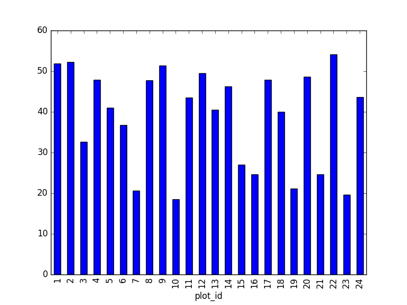
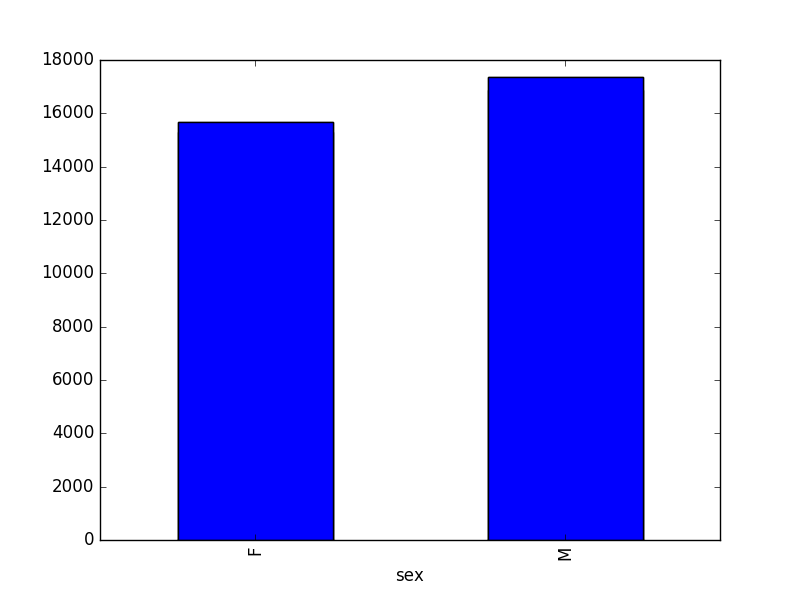

# Challenge solutions

## 00-short-introduction-to-Python

* What happens when you type `a_tuple[2] = 5` vs `a_list[1] = 5`?

	As a tuple is immutable, it does not support item assignment. Elements in a list can be altered individually.

* Type `type(a_tuple)` into python - what is the object type?

	`tuple`

* Can you do reassignment in a dictionary? Give it a try.

Make sure it is also clear that access to 'the second value' is actually just about the key name. Add for example `rev[10] = "ten"` to clarify it is not about the position.

## 01-starting-with-data

* `surveys_df.columns` 

	column names (optional: show `surveys_df.columns[4] = "plotid"` The index is not mutable; recap of previous lesson. Adapting the name is done by `rename` function `surveys_df.rename(columns={"plot_id": "plotid"})`)

* `surveys_df.head()`. Also, what does `surveys_df.head(15)` do?

	Show first `N` lines
	
* `surveys_df.tail()`
	
	Show last `N` lines
	
* `surveys_df.shape`. Take note of the output of the shape method. What format does it return the shape of the DataFrame in?

`type(surveys_df.shape)` -> `Tuple`

* Create a list of unique plot ID's found in the surveys data. Call it `plot_names`. How many unique plots are there in the data? How many unique species are in the data?

`plot_names = pd.unique(surveys_df["plot_id"])` Number of unique plot ID's: `plot_names.size` or `len(plot_names)`; Number of unique species in the data: `len(pd.unique(surveys_df["species"]))`

* How many recorded individuals are female `F` and how many male `M`?

`sorted.count()`

* What happens when you group by two columns using the following syntax and then grab mean values?

The mean value for each combination of plot and sex is calculated. Remark that the mean does not make sense for each variable, so you can specify this column wise: e.g. I want to know the last survey year, median foot-length and mean weight for each plot/sex combination: `surveys_df.groupby(['plot_id','sex']).agg({"year": 'min', "hindfoot_length": 'median', "weight": 'mean'})`

*  Summarize weight values for each plot in your data

`surveys_df.groupby(['plot_id'])['weight'].describe()`

* What's another way to create a list of species and associated count of the records in the data? 

Instead of getting the column of the groupby and counting it, you can also count on the groupby (all columns) and make a selection of the resulting data frame: `surveys_df.groupby('species_id').count()["record_id"]` 

* Create a plot of average weight across all species per plot.

`surveys_df.groupby('plot_id').mean()["weight"].plot(kind='bar')`

 

* Create a plot of total males versus total females for the entire datase

`surveys_df.groupby('sex').count()["record_id"].plot(kind='bar')`

## 02-index-slice-subset

* What value does the code below return? a[0]

`1`  Python starts with element 0 (for Matlab users: this is different)

* How about this: a[5]

`IndexError`

* Or this? a[len(a)]

`IndexError`

* In the example above, calling a[5] returns an error. Why is that?

5th element is a not existing element of the list (going from 0 till 4)

* What happens when you type:

`surveys_df[0:3]`
`surveys_df[:5]` slicing from first element makes 0 redundant
`surveys_df[-1:]` you can count back
Additional: You can also select every Nth row: `surveys_df[1:10:2]`. So, how to interpret `surveys_df[::-1]`?

* difference of `dat.iloc[0:4, 1:4]` versus `dat.loc[0:4, 1:4]`

Check the position, or the name. Cfr. the second is like it would be in a dictionary, asling for the key-names. Column names 1:4 do not exist, resulting in an error. Check also difference between `dat.loc[0:4]` and `dat.iloc[0:4]`

* Select a subset of rows in the `surveys_df` DataFrame that contain data from the year 1999 and that contain weight values less than or equal to 8. How many columns did you end up with? What did your neighbor get?

`surveys_df[(surveys_df["year"] == 1999) & (surveys_df["weight"] <= 8)]`; when only interested in how many, the sum of True values could be used as well: `sum((surveys_df["year"] == 1999) & (surveys_df["weight"] <= 8))` 

* You can use the `isin` command in python to query a DataFrame based upon a list of values as follows: `surveys_df[surveys_df['species_id'].isin([listGoesHere])]`. Use the `isin` function to find all plots that contain particular species in the surveys DataFrame. How many records contain these values?

For example, using `PB` and `PL`:  `surveys_df[surveys_df['species_id'].isin(['PB', 'PL'])]['plot_id'].unique()` provides a list of the plots with these species involved. With `surveys_df[surveys_df['species_id'].isin(['PB', 'PL'])].shape` the number of records can be derived.

* Create a query that finds all rows with a weight value > or equal to 0.

`surveys_df[surveys_df["weight"] >= 0]` Introduce already that all these slice operations are actually based on a *Boolean indexing* operation (next section in the lesson). The filter provides for each record if it satisfies (True) or not (False). The slicing itself interprets the True/False of each record.

* The `~` symbol in Python can be used to return the OPPOSITE of the selection that you specify in python. It is equivalent to is not in. Write a query that selects all rows that are NOT equal to 'M' or 'F' in the surveys data.

`surveys_df[~surveys_df["sex"].isin(['M', 'F'])]`

* Create a new DataFrame that only contains observations with sex values that are not female or male. Assign each sex value in the new DataFrame to a new value of 'x'.  Determine the number of null values in the subset.

New dataframe with the not male/female values: `surveys_df[~surveys_df['sex'].isin(['M', 'F'])]`. Calculating the number of Nan values `sum(surveys_df['sex'].isnull())`, which is equal to the number of none female/male records.

* Create a new DataFrame that contains only observations that are of sex male or female and where weight values are greater than 0. Create a stacked bar plot of average weight by plot with male vs female values stacked for each plot.

The selection of the data can be done with the `isin` operator: 
`stack_selection = surveys_df[(surveys_df['sex'].isin(['M', 'F'])) & surveys_df["weight"] > 0.][["sex", "weight", "plot_id"]]`. As we now the other values are all Nan values, we can also select all not null values: `stack_selection = surveys_df[(surveys_df['sex'].notnull()) & surveys_df["weight"] > 0.][["sex", "weight", "plot_id"]]` 
Next, we calculate the mean weight for each plot id and sex combination: `stack_selection = stack_selection.groupby(["plot_id", "sex"]).mean().unstack()`
And we can make a stacked bar plot from this:
`stack_selection.plot(kind='bar', stacked=True)`

However, due to the `unstack` command, the legend header contains two levels. In order to remove this, the column naming need to be simplified : 

