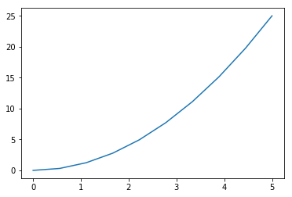
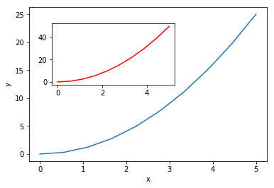

## Putting it all together

Up to this point, we have walked through tasks that are often
involved in handling and processing data using the workshop ready cleaned
files that we have provided. In this wrap-up exercise, we will perform
many of the same tasks with real data sets. This lesson also covers data
visualization.

As opposed to the previous ones, this lesson does not give step-by-step
directions to each of the tasks. Use the lesson materials you've already gone
through as well as the Python documentation to help you along.

## Obtain data

There are many repositories online from which you can obtain data. We are
providing you with one data file to use with these exercises, but feel free to
use any data that is relevant to your research. The file
`bouldercreek_09_2013.txt` contains stream discharge data, summarized at 15
15 minute intervals (in cubic feet per second) for a streamgage on Boulder
Creek at North 75th Street (USGS gage06730200) for 1-30 September 2013. If you'd
like to use this dataset, please find it in the data folder.

## Clean up your data and open it using Python and Pandas

To begin, import your data file into Python using Pandas. Did it fail? Your data
file probably has a header that Pandas does not recognize as part of the data
table. Remove this header, but do not simply delete it in a text editor! Use
either a shell script or Python to do this - you wouldn't want to do it by hand
if you had many files to process.

If you are still having trouble importing the data as a table using Pandas,
check the documentation. You can open the docstring in an ipython notebook using
a question mark. For example:

~~~
    import pandas as pd
    pd.read_csv?
~~~
{: .language-python}

Look through the function arguments to see if there is a default value that is
different from what your file requires (Hint: the problem is most likely the
delimiter or separator. Common delimiters are `','` for comma, `' '` for space,
and `'\t'` for tab).

Create a DataFrame that includes only the values of the data that are useful to
you. In the streamgage file, those values might be the date, time, and discharge
measurements. Convert any measurements in imperial units into SI units. You can
also change the name of the columns in the DataFrame like this:

~~~
    df = pd.DataFrame({'1stcolumn':[100,200], '2ndcolumn':[10,20]}) # this just creates a DataFrame for the example!
    print('With the old column names:\n') # the \n makes a new line, so it's easier to see
    print(df)

    df.columns = ['FirstColumn','SecondColumn'] # rename the columns!
    print('\n\nWith the new column names:\n')
    print(df)

    With the old column names:

       1stcolumn  2ndcolumn
    0        100         10
    1        200         20

    With the new column names:

       FirstColumn  SecondColumn
    0          100            10
    1          200            20
~~~
{: .language-python}

## Matplotlib plot library

[Matplotlib](http://matplotlib.org/) is a Python package used widely throughout the scientific Python community to produce high quality and publication-ready graphics. It supports a wide range of output formats including PNG (and other raster formats), PostScript/EPS, PDF and SVG. 

At the same time, matplotlib is the actual engine behind the plotting capabilities of both the Pandas as well as the plotnine package. So, if you you call the `.plot` functionality of Pandas, as we did in the previous episodes, you actually used the matplotlib package:

~~~
    import pandas as pd
    surveys = pd.read_csv("./data/surveys.csv")
	my_plot = surveys.plot("hindfoot_length", "weight", kind="scatter")
	my_plot
~~~
{: .language-python}

The returned object is a `matplotlib.axes._subplots.AxesSubplot` matplotlib object (check it yourself with `type(my_plot)`) and the power of matplotlib is available to further adjust these plots as it is created with matplotlib itself.

> ~~~
>     Matplotlib itself can be overwhelming, so a useful strategy is to 
>     do as much as you easily can in a convenience layer, i.e. start
>     creating the plot in Pandas or plotnine, and then use matplotlib
>     for the rest.
> ~~~
> {: .callout}

We will cover a few basic commands for creating and formatting plots with matplotlib in this lesson. A great resource for help creating and styling your figures is the matplotlib gallery
(http://matplotlib.org/gallery.html), which includes plots in many different
styles and the source code that creates them. 

### Using the matplotlib library

First, import the pyplot toolbox:

~~~
    import matplotlib.pyplot as plt
~~~
{: .language-python}

By default, matplotlib will create the figure in a separate window. When using
ipython notebooks, we can make figures appear in-line within the notebook by
writing:

~~~
    %matplotlib inline
~~~
{: .language-python}

### `plt` pyplot versus object based matplotlib

Consider the following example data:

~~~
    import numpy as np
    x = np.linspace(0, 5, 10)
    y = x ** 2
~~~
{: .language-python}

To make a scatter plot of `x` and `y`, we can directly use the `plot` command:

~~~
    plt.plot(x, y, '-')
~~~
{: .language-python}

or create a figure and ax object first and add the plot to the created ax object:

~~~
    fig, ax = plt.subplots()  # initiate an empty figure and ax matplotlib object
	ax.plot(x, y, '-')
~~~
{: .language-python}

Although the latter requires a little bit more code to create the same plot, the advantage is that we now have **full control** of where the plot axes are placed, and we can easily add new items or, for example more than one axis to the figure and adapting the labels::

~~~
    fig, ax1 = plt.subplots() #prepare a matplotlib figure
    ax1.plot(x, y, '-')
    
    # adapt the labels
    ax1.set_ylabel('y')
    ax1.set_xlabel('x')
    
    # add an additional ax to the figure
    ax2 = fig.add_axes([0.2, 0.5, 0.4, 0.3]) # inset axes
    ax2.plot(x, y*2, 'r-')
~~~
{: .language-python}

### Link matplotlib, Pandas and plotnine

The **Pandas and plotnine packages create matplotlib objects** as well. Hence, using the object based approach provides a consistent workflow and interaction between these packages:

~~~
    fig, ax1 = plt.subplots() #prepare a matplotlib figure

	surveys.plot("hindfoot_length", "weight", 
	             kind="scatter", ax=ax1) # use Pandas for plotting

    # Provide further adaptations with matplotlib:
    ax1.set_xlabel("Hindfoot length")
    ax1.tick_params(labelsize=16, pad=8)
    fig.suptitle('Scatter plot of weight versus hindfoot length', fontsize=15)
~~~
{: .language-python}

To retrieve the matplotlib figure object from plotnine for customization, use the `draw()` function in plotnine:

~~~
    import plotnine as p9
    myplot = (p9.ggplot(data=surveys, 
                        mapping=p9.aes(x='hindfoot_length', 
                                       y='weight')) +
              p9.geom_point())

    # convert output plotnine to a matplotlib object
    my_plt_version = myplot.draw()

    # Provide further adaptations with matplotlib:
    p9_ax = my_plt_version.axes[0] # each subplot is an item in a list
    p9_ax.set_xlabel("Hindfoot length")
    p9_ax.tick_params(labelsize=16, pad=8)
    p9_ax.set_title('Scatter plot of weight versus hindfoot length', fontsize=15)
    my_plt_version
~~~
{: .language-python}

> ## Challenge - Pandas and matplotlib
> Load the streamgage data set with Pandas, subset the week of the 2013 Front Range flood
> (September 9 through 15) and create a hydrograph (line plot) of the discharge data using
> Pandas, linking it to an empty maptlotlib `ax` object. Adapt the title, x-axis and y-axis label 
> using matplotlib.
>
> > ## Answers
> >
> > ~~~
> > discharge = pd.read_csv("./data/bouldercreek_09_2013.txt", 
> >                         skiprows=27, delimiter="\t", 
> >                         names=["agency", "site_id", "datetime",
> >                                "timezone", "discharge", "discharge_cd"])
> > discharge["datetime"] = pd.to_datetime(discharge["datetime"])
> > front_range = discharge[(discharge["datetime"] >= "2013-09-09") & 
> >                         (discharge["datetime"] < "2013-09-15")]
> > 
> > fig, ax = plt.subplots()
> > front_range.plot(x ="datetime", y="discharge", ax=ax)
> > ax.set_xlabel("") # no label
> > ax.set_ylabel("Discharge, cubic feet per second")
> > ax.set_title(" Front Range flood event 2013")
> > ~~~
> > {: .language-python}
> >
> > 
> {: .solution}
{: .challenge}

### Saving matplotlib figures

Once satisfied about the resulting plot, you can save the plot with the `.savefig(*args)` command from matplotlib:

~~~
fig.savefig("my_plot_name.png")    
~~~
{: .language-python}

Which will save the `fig` created using Pandas/matplotlib as a png file with the name `my_plot_name`

> ~~~
>     Matplotlib recognizes the extension used in the filename and
>     supports (on most computers) png, pdf, ps, eps and svg formats.
> ~~~
{: .callout}

> ## Challenge - Saving figure to file
> Check the documentation of the `savefig` command and check how 
> you can comply to journals requiring figures as `pdf` file with
> dpi >= 300.
>
> > ## Answers
> >
> > ~~~
> > fig.savefig("my_plot_name.pdf", dpi=300)
> > ~~~
> > {: .language-python}
> {: .solution}
{: .challenge}

## Make other types of plots:

Matplotlib can make many other types of plots in much the same way that it makes 2 dimensional line plots. Look through the examples in
http://matplotlib.org/users/screenshots.html and try a few of them (click on the
"Source code" link and copy and paste into a new cell in ipython notebook or
save as a text file with a `.py` extension and run in the command line).

> ## Challenge - Final Plot
> Display your data using one or more plot types from the example gallery. Which
> ones to choose will depend on the content of your own data file. If you are
> using the streamgage file `bouldercreek_09_2013.txt`, you could make a 
> histogram of the number of days with a given mean discharge, use bar plots 
> to display daily discharge statistics, or explore the different ways matplotlib 
> can handle dates and times for figures.
{: .challenge}



