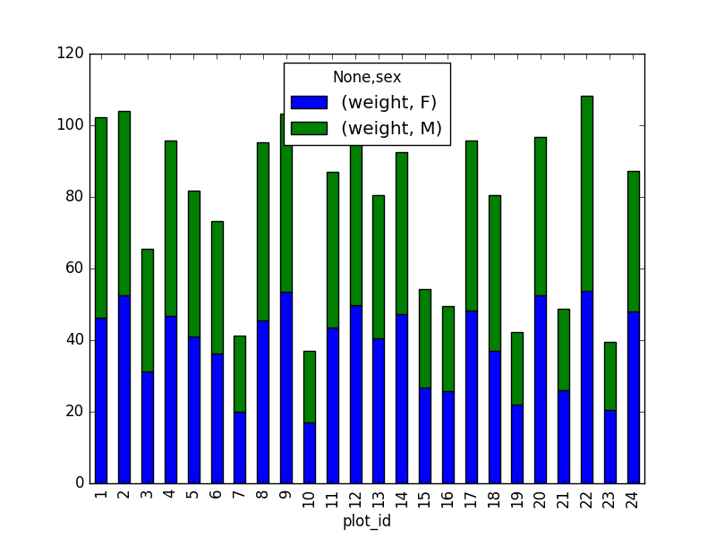
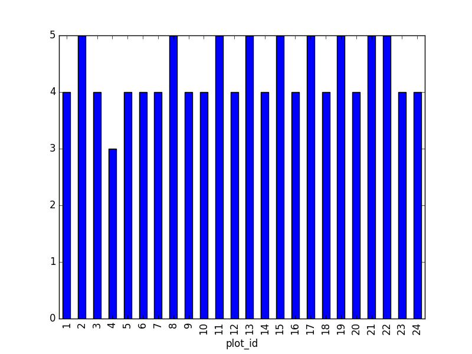
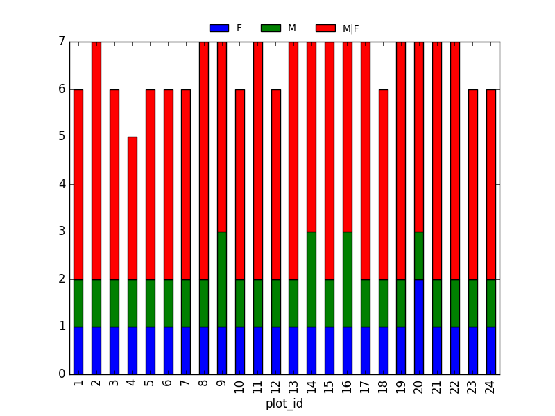
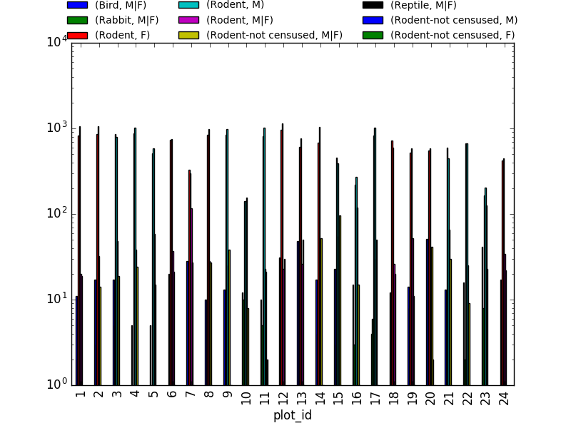
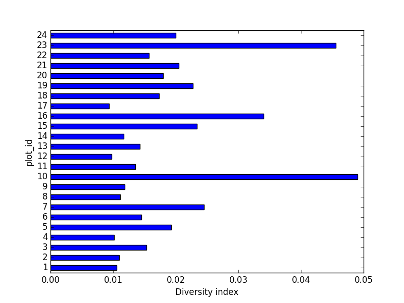

# Challenge solutions

## Install the required workshop packages

Please use the instructions in the [Setup](https://datacarpentry.org/python-ecology-lesson/setup.html) document to perform installs. If you encounter setup issues, please file an issue with the tags 'High-priority'.

## Checking installations.

In the `_include/scripts` directory, you will find a script called check_env.py This checks the functionality of the Anaconda install.

By default, Data Carpentry does not have people pull the whole repository with all the scripts and addenda. Therefore,
you, as the instructor, get to decide how you'd like to provide this script to learners, if at all.
To use this, students can navigate into `_includes/scripts` terminal, and execute the following:

~~~
python check_env.py
~~~
{: .language-bash}

If learners receive an `AssertionError`, it will inform you how to help them correct this
installation. Otherwise, it will tell you that the system is good to go and ready for Data Carpentry!

## 01-short-introduction-to-Python

### Tuples Challenges

* What happens when you execute `a_list[1] = 5`?
* What happens when you execute `a_tuple[2] = 5`?

	As a tuple is immutable, it does not support item assignment. Elements in a list can be altered individually.

* What does `type(a_tuple)` tell you about `a_tuple`?

	`tuple`

### Dictionaries Challenges

* Changing dictionaries: 2. Reassign the value that corresponds to the key `2`.

Make sure it is also clear that access to 'the value that corresponds to the key `2`' is actually just about the key name. Add for example `rev[10] = "ten"` to clarify it is not about the position.

~~~
rev
~~~
{: .language-python}
~~~
{1: 'one', 2: 'two', 3: 'three'}
~~~
{: .output}

~~~
rev[2] = "apple-sauce"
~~~
{: .language-python}

~~~
{1: 'one', 2: 'apple-sauce', 3: 'three'}
~~~
{: .output}

## 02-starting-with-data

> ## Important Bug Note
>
> In Pandas prior to 0.18.1 there is a bug causing `surveys_df['weight'].describe()` to return
> a runtime error.
{: .callout}

### Dataframe Challenges

* `surveys_df.columns`

	column names (optional: show `surveys_df.columns[4] = "plotid"` The index is not mutable; recap of previous lesson. Adapting the name is done by `rename` function `surveys_df.rename(columns={"plot_id": "plotid"})`)

* `surveys_df.head()`. Also, what does `surveys_df.head(15)` do?

	Show first 5 lines. Show first 15 lines.

* `surveys_df.tail()`

	Show last 5 lines

* `surveys_df.shape`. Take note of the output of the shape method. What format does it return the shape of the DataFrame in?

	`type(surveys_df.shape)` -> `Tuple`

### Calculating Statistics Challenges

* Create a list of unique plot ID's found in the surveys data. Call it `plot_names`. How many unique plots are in the data? How many unique species are in the data?

	`plot_names = pd.unique(surveys_df["plot_id"])` Number of unique plot ID's: `plot_names.size` or `len(plot_names)`; Number of unique species in the data: `len(pd.unique(surveys_df["species"]))`

* What is the difference between `len(plot_names)` and `surveys_df['plot_id'].nunique()`?

Both do result in the same output, making it alternative ways of getting the unique values. `nunique` combines the count and unique value extraction.

### Grouping Challenges

* How many recorded individuals are female `F` and how many male `M`?

	`grouped_data.count()`

* What happens when you group by two columns using the following syntax and then grab mean values?

	The mean value for each combination of plot and sex is calculated. Remark that the mean does not make sense for each variable, so you can specify this column-wise: e.g. I want to know the last survey year, median foot-length and mean weight for each plot/sex combination:

~~~
surveys_df.groupby(['plot_id','sex']).agg({"year": 'min',
                                           "hindfoot_length": 'median',
                                           "weight": 'mean'})`
~~~
{: .language-python}

*  Summarize the weight values for each plot in your data.

~~~
surveys_df.groupby(['plot_id'])['weight'].describe()
~~~
{: .language-python}

* Another Challenge: What is another way to create a list of species and the associated count of the records in the data?

	Instead of getting the column of the groupby and counting it, you can also count on the groupby (all columns) and make a selection of the resulting data frame: `surveys_df.groupby('species_id').count()["record_id"]`

### Plotting Challenges

* Create a plot of the average weight across all species per plot.

~~~
surveys_df.groupby('plot_id').mean()["weight"].plot(kind='bar')
~~~
{: .language-python}

* Create a plot of total males versus total females for the entire datase.

~~~
surveys_df.groupby('sex').count()["record_id"].plot(kind='bar')
~~~
{: .language-python}

## 03-index-slice-subset

Tip: use `.head()` method throughout this lesson to keep your display neater for students.  Encourage students to try with and without `.head()` to reinforce this useful tool and then to use it or not at their preference. For example, if a student worries about keeping up in pace with typing, let them know they can skip the `.head()`, but that you'll use it to keep more lines of previous steps visible.

### Indexing Challenges

* What value does the code below return? `a[0]`

	`1`, as  Python starts with element 0 (for Matlab users: this is different!)

* How about this: `a[5]`

	`IndexError`

* In the example above, calling `a[5]` returns an error. Why is that?

	The list has no element with index 5 (going from 0 till 4).

* What about? `a[len(a)]`

	`IndexError`

### Selection Challenges

* What happens when you execute:

	`surveys_df[0:3]`
	`surveys_df[0:1]` slicing only the first element
	`surveys_df[:5]` slicing from first element makes 0 redundant
	`surveys_df[-1:]` you can count backwards

	*Suggestion*: You can also select every Nth row: `surveys_df[1:10:2]`. So, how to interpret `surveys_df[::-1]`?

* What is the difference between `surveys_df.iloc[0:4, 1:4]` and `surveys_df.loc[0:4, 1:4]`?

	Check the position, or the name. Cfr. the second is like it would be in a dictionary, asking for the key-names. Column names 1:4 do not exist, resulting in an error. Check also the difference between `surveys_df.loc[0:4]` and `surveys_df.iloc[0:4]`

### Advanced Selection Challenges

* Select a subset of rows in the `surveys_df` DataFrame that contain data from the year 1999 and that contain weight values less than or equal to 8. How many columns did you end up with? What did your neighbor get?

	`surveys_df[(surveys_df["year"] == 1999) & (surveys_df["weight"] <= 8)]`; when only interested in how many,
	the sum of `True` values could be used as well: `sum((surveys_df["year"] == 1999) & (surveys_df["weight"] <= 8))`

* You can use the `isin` command in Python to query a DataFrame based upon a list of values as follows: `surveys_df[surveys_df['species_id'].isin([listGoesHere])]`. Use the `isin` function to find all plots that contain particular species in the surveys DataFrame. How many records contain these values?

	For example, using `PB` and `PL`:  `surveys_df[surveys_df['species_id'].isin(['PB', 'PL'])]['plot_id'].unique()` provides a list of the plots with these species involved. With `surveys_df[surveys_df['species_id'].isin(['PB', 'PL'])].shape` the number of records can be derived.

* Create a query that finds all rows with a weight value > or equal to 0.

	`surveys_df[surveys_df["weight"] >= 0]`

	*Suggestion*: Introduce already that all these slice operations are actually based on a *Boolean indexing* operation (next section in the lesson). The filter provides for each record if it satisfies (True) or not (False). The slicing itself interprets the True/False of each record.

* The `~` symbol in Python can be used to return the OPPOSITE of the selection that you specify in Python. It is equivalent to is not in. Write a query that selects all rows that are NOT equal to 'M' or 'F' in the surveys data.

~~~
surveys_df[~surveys_df["sex"].isin(['M', 'F'])]
~~~
{: .language-python}

### Masking Challenges

* Create a new DataFrame that only contains observations with sex values that are not female or male. Assign each sex value in the new DataFrame to a new value of 'x'. Determine the number of null values in the subset.

~~~
new = surveys_df[~surveys_df['sex'].isin(['M', 'F'])].copy()
new['sex']='x'
print(len(new))
~~~
{: .language-python}

Can verify the number of Nan values with `sum(surveys_df['sex'].isnull())`, which is equal to the number of none female/male records.

* Create a new DataFrame that contains only observations that are of sex male or female and where weight values are greater than 0. Create a stacked bar plot of average weight by plot with male vs female values stacked for each plot.

~~~
# selection of the data with isin
stack_selection = surveys_df[(surveys_df['sex'].isin(['M', 'F'])) &
							surveys_df["weight"] > 0.][["sex", "weight", "plot_id"]]
# calculate the mean weight for each plot id and sex combination:
stack_selection = stack_selection.groupby(["plot_id", "sex"]).mean().unstack()
# and we can make a stacked bar plot from this:
stack_selection.plot(kind='bar', stacked=True)
~~~
{: .language-python}

*Suggestion*: As we know the other values are all Nan values, we could also select all not null values (just preview, more on this in next lesson):
~~~
stack_selection = surveys_df[(surveys_df['sex'].notnull()) &
					surveys_df["weight"] > 0.][["sex", "weight", "plot_id"]]
~~~
{: .language-python}

However, due to the `unstack` command, the legend header contains two levels. In order to remove this, the column naming needs to be simplified :
~~~
stack_selection.columns = stack_selection.columns.droplevel()
~~~
{: .language-python}

## 04-data-types-and-format

### Challenge - Changing Types

* Try converting the column `plot_id` to floats using `surveys_df.plot_id.astype("float")`. 
Then, try converting the contents of the `weight` column to an integer type. 
What error messages does Pandas give you? What do these errors mean?

Pandas cannot convert types from float to int if the column contains NaN values.

### Challenge - Counting

* Count the number of missing values per column. Hint: The method `.count()` gives you the number of non-NA observations per column. Try looking to the `.isnull()` method.

~~~
surveys_df.isnull()
~~~
{: .language-python}

If the students have trouble generating the output, or anything happens with that, the folder `sample_output` in this repository contains the file `surveys_complete.csv` with the data they should generate.

## 05-merging-data

* In the data folder, there are two survey data files: survey2001.csv and survey2002.csv. Read the data into Python and combine the files to make one new data frame. Create a plot of average plot weight by year grouped by sex. Export your results as a CSV and make sure it reads back into Python properly.

~~~
# read the files:
survey2001 = pd.read_csv("data/survey2001.csv")
survey2002 = pd.read_csv("data/survey2002.csv")
# concatenate
survey_all = pd.concat([survey2001, survey2002], axis=0)
# get the weight for each year, grouped by sex:
weight_year = survey_all.groupby(['year', 'sex']).mean()["wgt"].unstack()
# plot:
weight_year.plot(kind="bar")
plt.tight_layout()  # tip(!)
~~~
{: .language-python}

~~~
# writing to file:
weight_year.to_csv("weight_for_year.csv")
# reading it back in:
pd.read_csv("weight_for_year.csv", index_col=0)
~~~
{: .language-python}

* Create a new DataFrame by joining the contents of the surveys.csv and species.csv tables.

~~~
merged_left = pd.merge(left=surveys_df,right=species_df, how='left', on="species_id")
~~~
{: .language-python}

Then calculate and plot the distribution of:

**1. taxa per plot** (number of species of each taxa per plot):

Species distribution (number of taxa for each plot) can be derived as follows:
~~~
merged_left.groupby(["plot_id"])["taxa"].nunique().plot(kind='bar')
~~~
{: .language-python}

*Suggestion*: It is also possible to plot the number of individuals for each taxa in each plot (stacked bar chart):
~~~
merged_left.groupby(["plot_id", "taxa"]).count()["record_id"].unstack().plot(kind='bar', stacked=True)
plt.legend(loc='upper center', ncol=3, bbox_to_anchor=(0.5, 1.05))
~~~
{: .language-python}
(the legend otherwise overlaps the bar plot)

**2. taxa by sex by plot**:
Providing the Nan values with the M|F values (can also already be changed to 'x'):
~~~
merged_left.loc[merged_left["sex"].isnull(), "sex"] = 'M|F'
~~~
{: .language-python}

Number of taxa for each plot/sex combination:
~~~
ntaxa_sex_site= merged_left.groupby(["plot_id", "sex"])["taxa"].nunique().reset_index(level=1)
ntaxa_sex_site = ntaxa_sex_site.pivot_table(values="taxa", columns="sex", index=ntaxa_sex_site.index)
ntaxa_sex_site.plot(kind="bar", legend=False)
plt.legend(loc='upper center', ncol=3, bbox_to_anchor=(0.5, 1.08),
           fontsize='small', frameon=False)
~~~
{: .language-python}

*Suggestion (for discussion only)*:

The number of individuals for each taxa in each plot per sex can be derived as well.

~~~
sex_taxa_site  = merged_left.groupby(["plot_id", "taxa", "sex"]).count()['record_id']
sex_taxa_site.unstack(level=[1, 2]).plot(kind='bar', logy=True)
plt.legend(loc='upper center', ncol=3, bbox_to_anchor=(0.5, 1.15),
           fontsize='small', frameon=False)
~~~
{: .language-python}

This is not really the best plot choice: not readable,... A first option to make this better, is to make facets. However, pandas/matplotlib do not provide this by default. Just as a pure matplotlib example (`M|F` if for not-defined sex records):

~~~
fig, axs = plt.subplots(3, 1)
for sex, ax in zip(["M", "F", "M|F"], axs):
    sex_taxa_site[sex_taxa_site["sex"] == sex].plot(kind='bar', ax=ax, legend=False)
    ax.set_ylabel(sex)
    if not ax.is_last_row():
        ax.set_xticks([])
        ax.set_xlabel("")
axs[0].legend(loc='upper center', ncol=5, bbox_to_anchor=(0.5, 1.3),
              fontsize='small', frameon=False)
~~~
{: .language-python}

However, it would be better to link to [Seaborn](https://stanford.edu/~mwaskom/software/seaborn/) and [Altair](https://github.com/ellisonbg/altair) for its kind of multivariate visualisations.

* In the data folder, there is a plot CSV that contains information about the type associated with each plot. Use that data to summarize the number of plots by plot type.

~~~
plot_info = pd.read_csv("data/plots.csv")
plot_info.groupby("plot_type").count()
~~~
{: .language-python}

* Calculate a diversity index of your choice for control vs rodent exclosure plots. The index should consider both species abundance and number of species. You might choose the simple biodiversity index described here which calculates diversity as `the number of species in the plot / the total number of individuals in the plot = Biodiversity index.`

~~~
merged_site_type = pd.merge(merged_left, plot_info, on='plot_id')
# For each plot, get the number of species for each plot
nspecies_site = merged_site_type.groupby(["plot_id"])["species"].nunique().rename("nspecies")
# For each plot, get the number of individuals
nindividuals_site = merged_site_type.groupby(["plot_id"]).count()['record_id'].rename("nindiv")
# combine the two series
diversity_index = pd.concat([nspecies_site, nindividuals_site], axis=1)
# calculate the diversity index
diversity_index['diversity'] = diversity_index['nspecies']/diversity_index['nindiv']
~~~
{: .language-python}

Making a bar chart:

~~~
diversity_index['diversity'].plot(kind="barh")
plt.xlabel("Diversity index")
~~~
{: .language-python}

## 06-loops-and-functions

### Basic Loop Challenges

* What happens if we do not include the `pass` statement?

	`SyntaxError:`

* Rewrite the loop so that the animals are separated by commas, not new lines (Hint: You can concatenate strings using a plus sign. For example, `print(string1 + string2)` outputs 'string1string2').

~~~
for creature in animals:
    print(creature+',', end='')
~~~
{: .language-python}

This loop also adds a comma after the last animal. A better, loop-free solution would be: `','.join(animals)`

### Looping Over Dataframe Challenges

* Some of the surveys you saved are missing data (they have null values that show up as NaN - Not A Number - in the DataFrames and do not show up in the text files). Modify the for loop so that the entries with null values are not included in the yearly files.

~~~
surveys_year = surveys_df[surveys_df.year == year].dropna()
~~~
{: .language-python}

* Let's say you only want to look at data from a given multiple of years. How would you modify your loop in order to generate a data file for only every 5th year, starting from 1977?

You could just make a list manually, however, why not check the first and last year making use of the code itself?

~~~
n_year = 5  # better overview by making variable from it
first_year = surveys_df['year'].min()
last_year = surveys_df['year'].max()

for year in range(first_year, last_year, n_year):
    print(year)

    # Select data for the year
    surveys_year = surveys_df[surveys_df.year == year].dropna()
~~~
{: .language-python}

* Instead of splitting out the data by years, a colleague wants to do analyses each species separately. How would you write a unique csv file for each species?

Similar to previous example, but use the `species_id` column. `surveys_df['species_id'].unique()`. However, the species names would improve interpretation of the file naming. A join with the species: `merged_left = pd.merge(left=surveys,right=species, how='left', on="species_id")` and using the `species` column.

### Functions Challenges

* Change the values of the arguments in the function and check its output.
* Try calling the function by giving it the wrong number of arguments (not 2), or not assigning the function call to a variable (no `product_of_inputs =`).
* Declare a variable inside the function and test to see where it exists (Hint: can you print it from outside the function?).
* Explore what happens when a variable both inside and outside the function have the same name. What happens to the global variable when you change the value of the local variable?

Show these in a debugging environment to make this more clear!

### Additional Functions Challenges

* Add two arguments to the functions we wrote that take the path of the directory where the files will be written and the root of the file name. Create a new set of files with a different name in a different directory.

~~~
def one_year_csv_writer(this_year, all_data, folder_to_save, root_name):
    """
    Writes a csv file for data from a given year.

    Parameters
    ---------
    this_year : int
        year for which data is extracted
    all_data: pd.DataFrame
        DataFrame with multi-year data
    folder_to_save : str
        folder to save the data files
    root_name: str
        root of the filenames to save the data
    """

    # Select data for the year
    surveys_year = all_data[all_data.year == this_year]

    # Write the new DataFrame to a csv file
    filename = os.path.join(folder_to_save, ''.join([root_name, str(this_year), '.csv']))
    surveys_year.to_csv(filename)
~~~
{: .language-python}
Also adapt function `yearly_data_csv_writer` with the additional inputs.

* How could you use the function `yearly_data_csv_writer` to create a csv file for only one year? (Hint: think about the syntax for `range`)

Adapt the input arguments, e.g. 1978, 1979.

### Output Management Challenges

* Make the functions return a list of the files they have written. There are many ways you can do this (and you should try them all!):
	* either of the functions can print to screen,
	just add `print("year " + str(this_year)+ " written to disk")` statement
	* either can use a return statement to give back numbers or strings to their function call,
	* or you can use some combination of the two.
	* You could also try using the os library to list the contents of directories.
		`os.listdir`

Implementation inside the function:
~~~
filenames = []
for year in range(start_year, end_year+1):
    filenames.append(one_year_csv_writer(year, all_data, folder_to_save, root_name))
return filenames
~~~
{: .language-python}

* Explore what happens when variables are declared inside each of the functions versus in the main (non-indented) body of your code. What is the scope of the variables (where are they visible)? What happens when they have the same name but are given different values?

* What type of object corresponds to a variable declared as `None`? (Hint: create a variable set to `None` and use the function `type()`)

~~~
NoneType
~~~
{: .output}

* Compare the behavior of the function `yearly_data_arg_test` when the arguments have `None` as a default and when they do not have default values.

* What happens if you only include a value for `start_year` in the function call? Can you write the function call with only a value for `end_year`? (Hint: think about how the function must be assigning values to each of the arguments - this is related to the need to put the arguments without default values before those with default values in the function definition!)

~~~
yearly_data_arg_test(surveys_df, end_year=2001)
~~~
{: .language-python}

### Functions Modifications Challenges

* Rewrite the `one_year_csv_writer` and `yearly_data_csv_writer` functions to have keyword arguments with default values.

~~~
def one_year_csv_writer(this_year, all_data, folder_to_save='./', root_name='survey'):
    """
    Writes a csv file for data from a given year.

    Parameters
    ---------
    this_year : int
        year for which data is extracted
    all_data: pd.DataFrame
        DataFrame with multi-year data
    folder_to_save : str
        folder to save the data files
    root_name: str
        root of the filenames to save the data
    """

    # Select data for the year
    surveys_year = all_data[all_data.year == this_year]

    # Write the new DataFrame to a csv file
    filename = os.path.join(folder_to_save, ''.join([root_name, str(this_year), '.csv']))
    surveys_year.to_csv(filename)
~~~
{: .language-python}

* Modify the functions so that they do not create yearly files if there is no data for a given year and display an alert to the user (Hint: use `for` loops and conditional statements to do this. For an extra challenge, use `try` statements!)

~~~
    # Write the new DataFrame to a csv file
    if len(surveys_year) > 0:
        filename = os.path.join(folder_to_save, ''.join([root_name, str(this_year), '.csv']))
        surveys_year.to_csv(filename)
    else:
        print("No data for year " + str(this_year))
~~~
{: .language-python}

* The code that you have written so far to loop through the years is good, however, it is not necessarily reproducible with different datasets. For instance, what happens to the code if we have additional years of data in our CSV files? Using the tools that you learned in the previous activities, make a list of all years represented in the data. Then create a loop to process your data, that begins at the earliest year and ends at the latest year using that list.

~~~
def yearly_data_csv_writer(all_data, yearcolumn="year",
                           folder_to_save='./', root_name='survey'):
    """
    Writes separate csv files for each year of data.

    all_data --- DataFrame with multi-year data
    yearcolumn --- column name containing the year of the data
    folder_to_save --- folder name to store files
    root_name --- start of the file names stored
    """
    years = all_data["year"].unique()

    # "end_year" is the last year of data we want to pull, so we loop to end_year+1
    filenames = []
    for year in years:
        filenames.append(one_year_csv_writer(year, all_data, folder_to_save, root_name))
    return filenames
~~~
{: .language-python}

## 07-visualization-ggplot-python

If the students have trouble generating the output, or anything happens with that, there is a file
called "sample output" that contains the data file they should have generated in lesson 3.

iPython notebooks for plotting can be viewed in the `_extras` folder

## 08-putting-it-all-together

Scientists often operate on mathematical equations. Being able to use them in their graphics has a
lot of added value. Luckily, Matplotlib provides powerful tools for text control. One of them is the
ability to use LaTeX mathematical notation, whenever text is used (you can learn more about LaTeX
math notation here: https://en.wikibooks.org/wiki/LaTeX/Mathematics). To use mathematical notation,
surround your text using the dollar sign ("$").  LaTeX uses the backslash character ("\\") a lot.
Since backslash has a special meaning in the Python strings, you should replace all the
LaTeX-related backslashes with two backslashes.

~~~
plt.plot(t, t, 'r--', label='$y=x$')
plt.plot(t, t**2 , 'bs-', label='$y=x^2$')
plt.plot(t, (t - 5)**2 + 5 * t - 0.5, 'g^:', label='$y=(x - 5)^2 + 5  x - \\frac{1}{2}$') # note the double backslash

plt.legend(loc='upper left', shadow=True, fontsize='x-large')

# Note the double backslashes in the line below.
plt.xlabel('This is the x axis. It can also contain math such as $\\bar{x}=\\frac{\\sum_{i=1}^{n} {x}} {N}$')
plt.ylabel('This is the y axis')
plt.title('This is the figure title')

plt.show()
~~~
{: .language-python}

## 09-working-with-sql

FIXME

[This page](https://matplotlib.org/users/mathtext.html) contains more information.

