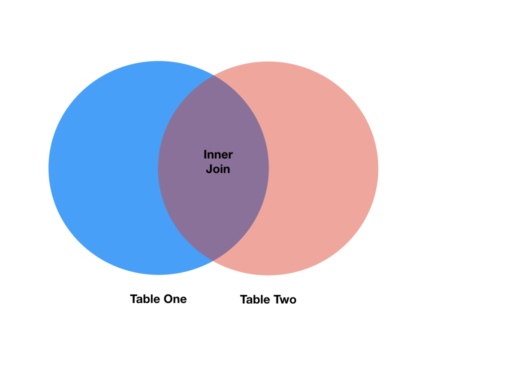
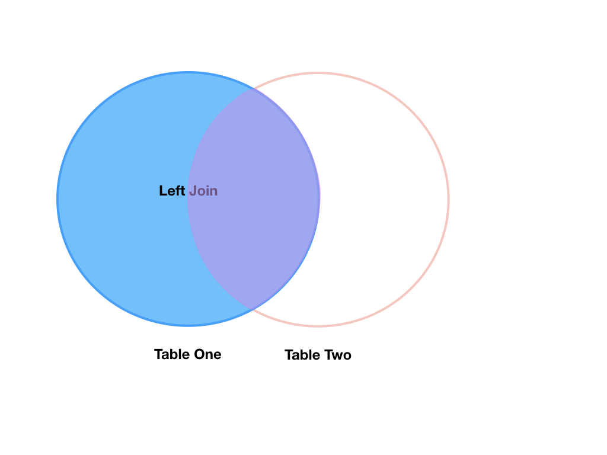

In many "real world" situations, the data that we want to use come in multiple
files. We often need to combine these files into a single DataFrame to analyze
the data. The pandas package provides [various methods for combining
DataFrames](https://pandas.pydata.org/pandas-docs/stable/user_guide/merging.html) including
`merge` and `concat`.

To work through the examples below, we first need to load the species and
surveys files into pandas DataFrames. In iPython:

~~~
import pandas as pd
surveys_df = pd.read_csv("data/surveys.csv",
                         keep_default_na=False, na_values=[""])
surveys_df

       record_id  month  day  year  plot species  sex  hindfoot_length weight
0              1      7   16  1977     2      NA    M               32  NaN
1              2      7   16  1977     3      NA    M               33  NaN
2              3      7   16  1977     2      DM    F               37  NaN
3              4      7   16  1977     7      DM    M               36  NaN
4              5      7   16  1977     3      DM    M               35  NaN
...          ...    ...  ...   ...   ...     ...  ...              ...  ...
35544      35545     12   31  2002    15      AH  NaN              NaN  NaN
35545      35546     12   31  2002    15      AH  NaN              NaN  NaN
35546      35547     12   31  2002    10      RM    F               15   14
35547      35548     12   31  2002     7      DO    M               36   51
35548      35549     12   31  2002     5     NaN  NaN              NaN  NaN

[35549 rows x 9 columns]

species_df = pd.read_csv("data/species.csv",
                         keep_default_na=False, na_values=[""])
species_df
  species_id             genus          species     taxa
0          AB        Amphispiza        bilineata     Bird
1          AH  Ammospermophilus          harrisi   Rodent
2          AS        Ammodramus       savannarum     Bird
3          BA           Baiomys          taylori   Rodent
4          CB   Campylorhynchus  brunneicapillus     Bird
..        ...               ...              ...      ...
49         UP            Pipilo              sp.     Bird
50         UR            Rodent              sp.   Rodent
51         US           Sparrow              sp.     Bird
52         ZL       Zonotrichia       leucophrys     Bird
53         ZM           Zenaida         macroura     Bird

[54 rows x 4 columns]
~~~
{: .language-python}

Take note that the `read_csv` method we used can take some additional options which
we didn't use previously. Many functions in Python have a set of options that
can be set by the user if needed. In this case, we have told pandas to assign
empty values in our CSV to NaN `keep_default_na=False, na_values=[""]`.
[More about all of the read_csv options here.](https://pandas.pydata.org/pandas-docs/stable/reference/api/pandas.read_csv.html#pandas.read_csv)

# Concatenating DataFrames

We can use the `concat` function in pandas to append either columns or rows from
one DataFrame to another.  Let's grab two subsets of our data to see how this
works.

~~~
# Read in first 10 lines of surveys table
survey_sub = surveys_df.head(10)
# Grab the last 10 rows
survey_sub_last10 = surveys_df.tail(10)
# Reset the index values to the second dataframe appends properly
survey_sub_last10 = survey_sub_last10.reset_index(drop=True)
# drop=True option avoids adding new index column with old index values
~~~
{: .language-python}

When we concatenate DataFrames, we need to specify the axis. `axis=0` tells
pandas to stack the second DataFrame UNDER the first one. It will automatically
detect whether the column names are the same and will stack accordingly.
`axis=1` will stack the columns in the second DataFrame to the RIGHT of the
first DataFrame. To stack the data vertically, we need to make sure we have the
same columns and associated column format in both datasets. When we stack
horizontally, we want to make sure what we are doing makes sense (i.e. the data are
related in some way).

~~~
# Stack the DataFrames on top of each other
vertical_stack = pd.concat([survey_sub, survey_sub_last10], axis=0)

# Place the DataFrames side by side
horizontal_stack = pd.concat([survey_sub, survey_sub_last10], axis=1)
~~~
{: .language-python}

### Row Index Values and Concat
Have a look at the `vertical_stack` dataframe? Notice anything unusual?
The row indexes for the two data frames `survey_sub` and `survey_sub_last10`
have been repeated. We can reindex the new dataframe using the `reset_index()` method.

## Writing Out Data to CSV

We can use the `to_csv` command to do export a DataFrame in CSV format. Note that the code
below will by default save the data into the current working directory. We can
save it to a different folder by adding the foldername and a slash to the file
`vertical_stack.to_csv('foldername/out.csv')`. We use the 'index=False' so that
pandas doesn't include the index number for each line.

~~~
# Write DataFrame to CSV
vertical_stack.to_csv('data_output/out.csv', index=False)
~~~
{: .language-python}

Check out your working directory to make sure the CSV wrote out properly, and
that you can open it! If you want, try to bring it back into Python to make sure
it imports properly.

~~~
# For kicks read our output back into Python and make sure all looks good
new_output = pd.read_csv('data_output/out.csv', keep_default_na=False, na_values=[""])
~~~
{: .language-python}

> ## Challenge - Combine Data
>
> In the data folder, there are two survey data files: `surveys2001.csv` and
> `surveys2002.csv`. Read the data into Python and combine the files to make one
> new data frame. Create a plot of average plot weight by year grouped by sex.
> Export your results as a CSV and make sure it reads back into Python properly.
{: .challenge}

# Joining DataFrames

When we concatenated our DataFrames we simply added them to each other -
stacking them either vertically or side by side. Another way to combine
DataFrames is to use columns in each dataset that contain common values (a
common unique id). Combining DataFrames using a common field is called
"joining". The columns containing the common values are called "join key(s)".
Joining DataFrames in this way is often useful when one DataFrame is a "lookup
table" containing additional data that we want to include in the other.

NOTE: This process of joining tables is similar to what we do with tables in an
SQL database.

For example, the `species.csv` file that we've been working with is a lookup
table. This table contains the genus, species and taxa code for 55 species. The
species code is unique for each line. These species are identified in our survey
data as well using the unique species code. Rather than adding 3 more columns
for the genus, species and taxa to each of the 35,549 line Survey data table, we
can maintain the shorter table with the species information. When we want to
access that information, we can create a query that joins the additional columns
of information to the Survey data.

Storing data in this way has many benefits including:

1. It ensures consistency in the spelling of species attributes (genus, species
   and taxa) given each species is only entered once. Imagine the possibilities
   for spelling errors when entering the genus and species thousands of times!
2. It also makes it easy for us to make changes to the species information once
   without having to find each instance of it in the larger survey data.
3. It optimizes the size of our data.

## Joining Two DataFrames

To better understand joins, let's grab the first 10 lines of our data as a
subset to work with. We'll use the `.head` method to do this. We'll also read
in a subset of the species table.

~~~
# Read in first 10 lines of surveys table
survey_sub = surveys_df.head(10)

# Import a small subset of the species data designed for this part of the lesson.
# It is stored in the data folder.
species_sub = pd.read_csv('data/speciesSubset.csv', keep_default_na=False, na_values=[""])
~~~
{: .language-python}

In this example, `species_sub` is the lookup table containing genus, species, and
taxa names that we want to join with the data in `survey_sub` to produce a new
DataFrame that contains all of the columns from both `species_df` *and*
`survey_df`.

## Identifying join keys

To identify appropriate join keys we first need to know which field(s) are
shared between the files (DataFrames). We might inspect both DataFrames to
identify these columns. If we are lucky, both DataFrames will have columns with
the same name that also contain the same data. If we are less lucky, we need to
identify a (differently-named) column in each DataFrame that contains the same
information.

~~~
>>> species_sub.columns

Index([u'species_id', u'genus', u'species', u'taxa'], dtype='object')

>>> survey_sub.columns

Index([u'record_id', u'month', u'day', u'year', u'plot_id', u'species_id',
       u'sex', u'hindfoot_length', u'weight'], dtype='object')
~~~
{: .language-python}

In our example, the join key is the column containing the two-letter species
identifier, which is called `species_id`.

Now that we know the fields with the common species ID attributes in each
DataFrame, we are almost ready to join our data. However, since there are
[different types of joins][join-types], we
also need to decide which type of join makes sense for our analysis.

## Inner joins

The most common type of join is called an _inner join_. An inner join combines
two DataFrames based on a join key and returns a new DataFrame that contains
**only** those rows that have matching values in *both* of the original
DataFrames.

Inner joins yield a DataFrame that contains only rows where the value being
joined exists in BOTH tables. An example of an inner join, adapted from [Jeff Atwood's blogpost about SQL joins][join-types] is below:

The pandas function for performing joins is called `merge` and an Inner join is
the default option:

~~~
merged_inner = pd.merge(left=survey_sub, right=species_sub, left_on='species_id', right_on='species_id')
# In this case `species_id` is the only column name in  both dataframes, so if we skipped `left_on`
# And `right_on` arguments we would still get the same result

# What's the size of the output data?
merged_inner.shape
merged_inner
~~~
{: .language-python}

~~~
   record_id  month  day  year  plot_id species_id sex  hindfoot_length  \
0          1      7   16  1977        2         NL   M               32
1          2      7   16  1977        3         NL   M               33
2          3      7   16  1977        2         DM   F               37
3          4      7   16  1977        7         DM   M               36
4          5      7   16  1977        3         DM   M               35
5          8      7   16  1977        1         DM   M               37
6          9      7   16  1977        1         DM   F               34
7          7      7   16  1977        2         PE   F              NaN

   weight       genus   species    taxa
0     NaN     Neotoma  albigula  Rodent
1     NaN     Neotoma  albigula  Rodent
2     NaN   Dipodomys  merriami  Rodent
3     NaN   Dipodomys  merriami  Rodent
4     NaN   Dipodomys  merriami  Rodent
5     NaN   Dipodomys  merriami  Rodent
6     NaN   Dipodomys  merriami  Rodent
7     NaN  Peromyscus  eremicus  Rodent
~~~
{: .output}

The result of an inner join of `survey_sub` and `species_sub` is a new DataFrame
that contains the combined set of columns from `survey_sub` and `species_sub`. It
*only* contains rows that have two-letter species codes that are the same in
both the `survey_sub` and `species_sub` DataFrames. In other words, if a row in
`survey_sub` has a value of `species_id` that does *not* appear in the `species_id`
column of `species`, it will not be included in the DataFrame returned by an
inner join.  Similarly, if a row in `species_sub` has a value of `species_id`
that does *not* appear in the `species_id` column of `survey_sub`, that row will not
be included in the DataFrame returned by an inner join.

The two DataFrames that we want to join are passed to the `merge` function using
the `left` and `right` argument. The `left_on='species'` argument tells `merge`
to use the `species_id` column as the join key from `survey_sub` (the `left`
DataFrame). Similarly , the `right_on='species_id'` argument tells `merge` to
use the `species_id` column as the join key from `species_sub` (the `right`
DataFrame). For inner joins, the order of the `left` and `right` arguments does
not matter.

The result `merged_inner` DataFrame contains all of the columns from `survey_sub`
(record id, month, day, etc.) as well as all the columns from `species_sub`
(species_id, genus, species, and taxa).

Notice that `merged_inner` has fewer rows than `survey_sub`. This is an
indication that there were rows in `surveys_df` with value(s) for `species_id` that
do not exist as value(s) for `species_id` in `species_df`.

## Left joins

What if we want to add information from `species_sub` to `survey_sub` without
losing any of the information from `survey_sub`? In this case, we use a different
type of join called a "left outer join", or a "left join".

Like an inner join, a left join uses join keys to combine two DataFrames. Unlike
an inner join, a left join will return *all* of the rows from the `left`
DataFrame, even those rows whose join key(s) do not have values in the `right`
DataFrame.  Rows in the `left` DataFrame that are missing values for the join
key(s) in the `right` DataFrame will simply have null (i.e., NaN or None) values
for those columns in the resulting joined DataFrame.

Note: a left join will still discard rows from the `right` DataFrame that do not
have values for the join key(s) in the `left` DataFrame.

A left join is performed in pandas by calling the same `merge` function used for
inner join, but using the `how='left'` argument:

~~~
merged_left = pd.merge(left=survey_sub, right=species_sub, how='left', left_on='species_id', right_on='species_id')
merged_left
~~~
{: .language-python}
~~~
   record_id  month  day  year  plot_id species_id sex  hindfoot_length  \
0          1      7   16  1977        2         NL   M               32
1          2      7   16  1977        3         NL   M               33
2          3      7   16  1977        2         DM   F               37
3          4      7   16  1977        7         DM   M               36
4          5      7   16  1977        3         DM   M               35
5          6      7   16  1977        1         PF   M               14
6          7      7   16  1977        2         PE   F              NaN
7          8      7   16  1977        1         DM   M               37
8          9      7   16  1977        1         DM   F               34
9         10      7   16  1977        6         PF   F               20

   weight       genus   species    taxa
0     NaN     Neotoma  albigula  Rodent
1     NaN     Neotoma  albigula  Rodent
2     NaN   Dipodomys  merriami  Rodent
3     NaN   Dipodomys  merriami  Rodent
4     NaN   Dipodomys  merriami  Rodent
5     NaN         NaN       NaN     NaN
6     NaN  Peromyscus  eremicus  Rodent
7     NaN   Dipodomys  merriami  Rodent
8     NaN   Dipodomys  merriami  Rodent
9     NaN         NaN       NaN     NaN
~~~
{: .output}

The result DataFrame from a left join (`merged_left`) looks very much like the
result DataFrame from an inner join (`merged_inner`) in terms of the columns it
contains. However, unlike `merged_inner`, `merged_left` contains the **same
number of rows** as the original `survey_sub` DataFrame. When we inspect
`merged_left`, we find there are rows where the information that should have
come from `species_sub` (i.e., `species_id`, `genus`, and `taxa`) is
missing (they contain NaN values):

~~~
merged_left[ pd.isnull(merged_left.genus) ]
~~~
{: .language-python}
~~~
   record_id  month  day  year  plot_id species_id sex  hindfoot_length  \
5          6      7   16  1977        1         PF   M               14
9         10      7   16  1977        6         PF   F               20

   weight genus species taxa
5     NaN   NaN     NaN  NaN
9     NaN   NaN     NaN  NaN
~~~
{: .output}

These rows are the ones where the value of `species_id` from `survey_sub` (in this
case, `PF`) does not occur in `species_sub`.

## Other join types

The pandas `merge` function supports two other join types:

* Right (outer) join: Invoked by passing `how='right'` as an argument. Similar
  to a left join, except *all* rows from the `right` DataFrame are kept, while
  rows from the `left` DataFrame without matching join key(s) values are
  discarded.
* Full (outer) join: Invoked by passing `how='outer'` as an argument. This join
  type returns the all pairwise combinations of rows from both DataFrames; i.e.,
  the result DataFrame will `NaN` where data is missing in one of the dataframes. This join type is
  very rarely used.

# Final Challenges

> ## Challenge - Distributions
> Create a new DataFrame by joining the contents of the `surveys.csv` and
> `species.csv` tables. Then calculate and plot the distribution of:
>
> 1. taxa by plot
> 2. taxa by sex by plot
{: .challenge}

> ## Challenge - Diversity Index
>
> 1. In the data folder, there is a `plots.csv` file that contains information about the
>    type associated with each plot. Use that data to summarize the number of
>    plots by plot type.
> 2. Calculate a diversity index of your choice for control vs rodent exclosure
>    plots. The index should consider both species abundance and number of
>    species. You might choose to use the simple [biodiversity index described
>    here](http://www.amnh.org/explore/curriculum-collections/biodiversity-counts/plant-ecology/how-to-calculate-a-biodiversity-index)
>    which calculates diversity as:
>
>    the number of species in the plot / the total number of individuals in the plot = Biodiversity index.
{: .challenge}

[join-types]: http://blog.codinghorror.com/a-visual-explanation-of-sql-joins/


